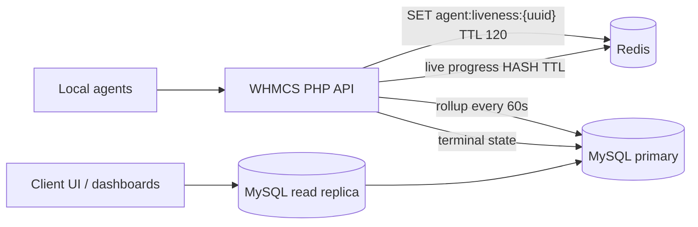

# Redis / SSE Scaling Spike — e3 Cloud Backup

Design notes for moving ephemeral agent state off the primary MySQL instance at thousands-of-agents scale.

## Problem

Even after debounced `last_seen_at`, sargable run heartbeats, and combined agent polling, idle fleets still generate:

- ~1 auth SELECT per agent poll endpoint per debounce window
- `agent_update_run` writes every 2–5s per active backup
- Dashboard/UI reads against the same primary as write-heavy agent paths

## Proposed architecture

## Phase A — Agent liveness (low risk)

1. **Write path**: `AgentAuth::touchLastSeenIfStale()` checks Redis `GET agent:liveness:{uuid}`; on miss, `SETEX` 120s and enqueue async/batched MySQL `UPDATE last_seen_at` (or flush from a 60s cron).
2. **Read path**: Online detection in `e3backup_agent_list.php` reads Redis first; fall back to `last_seen_at` when Redis unavailable.
3. **Key schema**: `agent:liveness:{agent_uuid}` → Unix timestamp; optional `agent:meta:{uuid}` HASH for version/os.

## Phase B — Live run progress (medium risk)

1. Store in Redis HASH `run:live:{run_id}`: `progress_pct`, `bytes_transferred`, `updated_at`.
2. `agent_update_run.php` writes Redis on every heartbeat; MySQL `s3_cloudbackup_runs` updated every 30–60s or on status transition.
3. Live dashboard endpoints read Redis for in-flight runs; history remains MySQL.

## Phase C — Command delivery (higher effort)

Replace fixed-interval polling with:

- **Long poll**: `agent_poll.php` blocks up to 25s when no commands, returns immediately on command enqueue (requires Redis pub/sub or list pop).
- **SSE/WebSocket** from a small sidecar (or FrankenPHP worker) subscribed to `agent:cmd:{uuid}` channels.

## Read replica usage

- Route read-only endpoints (`e3backup_run_list`, `e3backup_job_list`, admin dashboards) to a WHMCS read replica connection when `DB_READ_HOST` is configured.
- Keep claim/watchdog/cancel paths on primary.

## Rollout / safety

| Step | Rollback |
|------|----------|
| Deploy Redis + dual-write liveness | Disable Redis env flag; MySQL path unchanged |
| Enable read replica for UI | Point UI back to primary |
| Long-poll agent release | Agent falls back to combined poll |

## Environment variables (proposed)

- `CLOUDBACKUP_REDIS_URL` — Redis DSN
- `CLOUDBACKUP_LIVENESS_REDIS_TTL` — default 120
- `CLOUDBACKUP_RUN_PROGRESS_MYSQL_FLUSH_SECS` — default 60
- `WHMCS_DB_READ_HOST` — optional read replica

## Next implementation steps

1. Add `lib/Client/RedisConnection.php` with graceful no-op when extension/DSN missing.
2. Spike dual-write in `AgentAuth` behind `cloudbackup_redis_liveness_enabled` module setting.
3. Load-test 1k simulated agents with `vegeta` against `agent_poll.php` + Redis vs baseline metrics.
