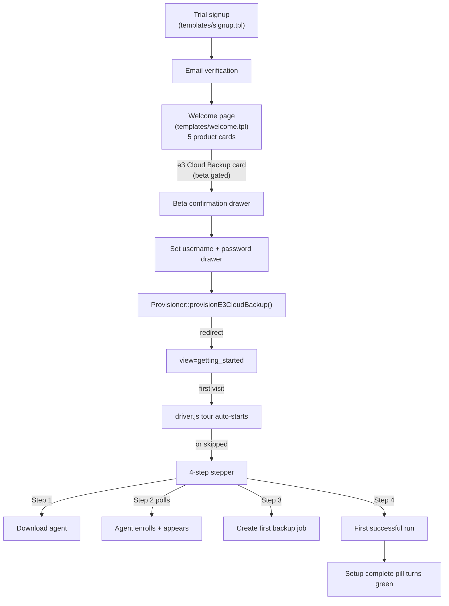
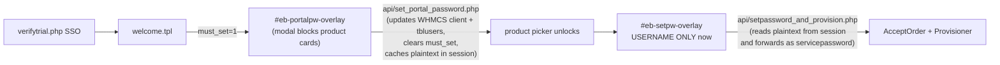

# e3 Cloud Backup - First-Run Onboarding

This document describes the customer-facing onboarding experience that lands
a new e3 Cloud Backup customer between sign-up and their first successful
backup. It covers the Getting Started page, the guided driver.js tour, the
persistent setup pill, the zero-agent sidebar trim, and the supporting
schema + APIs.

Companion docs:

- [`BETA_ONBOARDING.md`](BETA_ONBOARDING.md) - external-facing beta cheat
  sheet for the eight-or-so customer-facing steps.
- [`E3_CLOUD_BACKUP_BILLING.md`](E3_CLOUD_BACKUP_BILLING.md) - the billing
  subsystem the trial state interacts with.
- [`CLOUD_STORAGE_README.md`](CLOUD_STORAGE_README.md) - top-level reference
  for the addon as a whole.

---

## 1. End-to-end customer journey



The Welcome page, beta gate, password drawer and `provisionE3CloudBackup` are
described in `BETA_ONBOARDING.md` and the billing doc. This document picks up
at the redirect.

---

## 2. The four-step model

The onboarding state for every client is a small struct produced by
[`lib/Client/OnboardingState.php`](../lib/Client/OnboardingState.php)
`::compute($clientId)`:

```text
{
  "client_id": 42,
  "steps": {
    "download":      { "complete": true,  "completed_at": "..." },
    "agent_online":  { "complete": false, "completed_at": null, "agent_count": 0 },
    "first_job":     { "complete": false, "completed_at": null, "job_count": 0 },
    "first_run":     { "complete": false, "completed_at": null, "run_count": 0 }
  },
  "completed_count": 1,
  "total_count": 4,
  "all_complete": false,
  "tour_started": false,
  "tour_completed": false,
  "tour_dismissed": false,
  "last_visited_at": "..."
}
```

Step completion sources (derived live - **no fanout cron required**):

| Step | Detection |
| ---- | --------- |
| `download` | A row exists in `s3_e3backup_onboarding_state` with `download_clicked_at IS NOT NULL`. |
| `agent_online` | `COUNT(s3_cloudbackup_agents WHERE client_id=X AND status='active' AND last_seen_at IS NOT NULL) >= 1` |
| `first_job` | `COUNT(s3_cloudbackup_jobs WHERE client_id=X AND status='active') >= 1` |
| `first_run` | `COUNT(s3_cloudbackup_runs r JOIN s3_cloudbackup_jobs j ON r.job_id=j.job_id WHERE j.client_id=X AND r.status='success') >= 1` |

Tour flags (`tour_started`, `tour_completed`, `tour_dismissed`) live in the
same state row and are write-once timestamps.

---

## 3. Persistent storage

### Table: `s3_e3backup_onboarding_state`

Created by [`cloudstorage_ensure_e3cb_billing_schema()`](../cloudstorage.php)
on activate + upgrade.

```text
client_id                       INT UNSIGNED PRIMARY KEY
download_clicked_at             TIMESTAMP NULL
tour_started_at                 TIMESTAMP NULL    -- Welcome tour (Getting Started)
tour_completed_at               TIMESTAMP NULL
tour_dismissed_at               TIMESTAMP NULL
first_job_tour_started_at       TIMESTAMP NULL    -- First-Job tour (Users / User Detail)
first_job_tour_completed_at     TIMESTAMP NULL
first_job_tour_dismissed_at     TIMESTAMP NULL
last_visited_getting_started_at TIMESTAMP NULL
created_at, updated_at          TIMESTAMP
```

Two distinct sets of `tour_*` columns track the two guided tours described
in Sections 6 and 6a respectively. Both sets follow the same write-once
audit-log invariant.

Important invariants:

- All `*_at` columns are **write-once**. `OnboardingState::recordEvent()`
  refuses to overwrite an already-set timestamp. This means the row doubles
  as an audit log: "when did this customer first click Download?", "when did
  they first try the tour?", etc.
- The row is auto-created on the first event (event recorder calls
  `ensureRow()` lazily).
- There is no cascade delete from `tblclients` - the deprovision helper
  (`DeprovisionHelper::resetOnboarding`) explicitly drops the row when a
  client is reset for QA.

### Helper class

[`lib/Client/OnboardingState.php`](../lib/Client/OnboardingState.php)
exposes:

| Method | Purpose |
| ------ | ------- |
| `compute(int $clientId): array` | Full status payload. Called from the API + the page handler + the e3backup app-shell to compute the pill counter. |
| `recordEvent(int $clientId, string $event): bool` | Write-once setter for the four event columns. Event constants live on the class. |
| `touchVisit(int $clientId): void` | Updates `last_visited_getting_started_at`. Called from the page handler. |

---

## 4. APIs

### `api/e3backup_onboarding_status.php`

Read-only. Returns the `OnboardingState::compute()` payload as JSON. Polled
every 5 s by the Getting Started page and (indirectly, via
broadcast event) by the persistent pill.

### `api/e3backup_onboarding_event.php`

Write-only. Records a single click event:

```text
POST event=download_clicked
POST event=tour_started
POST event=tour_completed
POST event=tour_dismissed
POST event=first_job_tour_started
POST event=first_job_tour_completed
POST event=first_job_tour_dismissed
```

Both endpoints require an active client-area session.

### Cross-component event bus

When any code in the e3backup section records an event, it dispatches a
`window` event:

```js
window.dispatchEvent(new Event('eb-e3-onboarding-event'));
```

Listeners on the Getting Started page (`ebGettingStarted.refresh()`) react
to this immediately, so stepper checkmarks update without waiting for the
5-second poll.

---

## 5. The Getting Started page

[`templates/e3backup_getting_started.tpl`](../templates/e3backup_getting_started.tpl)
is the post-provision landing page. It is served by
[`pages/e3backup_getting_started.php`](../pages/e3backup_getting_started.php)
which:

1. Records a visit (`OnboardingState::touchVisit()`).
2. Computes the initial state.
3. Resolves the customer's default `s3_backup_users` row.
4. Resolves the customer's email (used by the sign-in cheat sheet).

### Layout

```
+-----------------------------------------------------------+
| HERO CARD                                                 |
|  Welcome eyebrow                                          |
|  "Get your first backup running" title                    |
|  "Follow the four steps below" description                |
|  [Start tour | Replay tour] [Skip the tour]               |
|  --- Setup progress bar (X of 4) ---                      |
+-----------------------------------------------------------+
| STEP CARD GRID (2-up on lg, 1-up on mobile)               |
|  +------------------+  +------------------+               |
|  | Step 1 Download  |  | Step 2 Sign in   |               |
|  +------------------+  +------------------+               |
|  +------------------+  +------------------+               |
|  | Step 3 First job |  | Step 4 First run |               |
|  +------------------+  +------------------+               |
+-----------------------------------------------------------+
| SIGN-IN CHEAT SHEET                                       |
|  Email | Password | Backup user (eb-kv-list)              |
+-----------------------------------------------------------+
| ALL-DONE banner (eb-alert--success, conditional)          |
+-----------------------------------------------------------+
```

### Alpine component (`ebGettingStarted`)

Initialised with the JSON-encoded `compute()` payload so the page renders
correctly even before the first poll. Key methods:

| Method | Notes |
| ------ | ----- |
| `init()` | Schedules `setInterval(refresh, 5000)`, listens for `eb-e3-onboarding-event`, and asks `window.ebE3Tour.maybeAutoStart(state)` to consider auto-starting. |
| `refresh()` | Re-fetches `api/e3backup_onboarding_status.php` and overwrites `state`. Stops polling once `all_complete`. |
| `recordEvent(event)` | Posts to `api/e3backup_onboarding_event.php` and dispatches the cross-component broadcast. |
| `openDownload()` | Records `download_clicked` and dispatches the existing `open-e3-download-flyout` event. |
| `startTour()` | Records `tour_started` and calls `window.ebE3Tour.start()`. |
| `dismissTour()` | Records `tour_dismissed` and calls `window.ebE3Tour.destroy()`. |

### Replay behavior (important)

The "Start tour" button is **always rendered**. Its label switches between
"Start tour" and "Replay tour" via:

```html
<span x-text="(state.tour_completed || state.tour_dismissed) ? 'Replay tour' : 'Start tour'"></span>
```

This means a customer who skipped or finished the tour can re-launch it any
time, by visiting Getting Started (or clicking the persistent pill) and
pressing the button.

---

## 6. The driver.js tour

### Vendored assets

```text
assets/vendor/driver/driver.js.iife.js   (driver.js v1.3.1 IIFE build, MIT)
assets/vendor/driver/driver.css          (default driver.js styles)
```

Loaded from [`templates/partials/e3backup_shell.tpl`](../templates/partials/e3backup_shell.tpl)
on **every** e3backup page so the tour can be triggered from anywhere.

### Tour controller

[`assets/js/e3backup_tour.js`](../assets/js/e3backup_tour.js) defines a
single global, `window.ebE3Tour`, with three methods:

| Method | Behavior |
| ------ | -------- |
| `start()` | Builds a driver instance from the steps whose anchors exist on the current page and calls `drive()`. Records `tour_started`. If no anchors exist, navigates the customer to Getting Started instead. |
| `destroy()` | Tears down the active driver. |
| `maybeAutoStart(state)` | Used by Getting Started's `init()`. Only auto-starts when: the URL is `view=getting_started`, AND `tour_started` is false, AND neither `tour_completed` nor `tour_dismissed` is true, AND `all_complete` is false. |

### The six steps

| # | Anchor | Title | Body (abbrev.) |
| - | ------ | ----- | -------------- |
| 1 | `[data-tour="sidebar-getting-started"]` | Your home base | "Come back to Getting Started any time..." |
| 2 | `[data-tour="sidebar-download"]` | Get the installer here | "Click Download Agent any time you need the installer..." |
| 3 | `[data-tour="gs-step-download"]` | Step 1 - Download | "Pick Windows or Linux..." |
| 4 | `[data-tour="gs-step-agent-online"]` | Step 2 - Sign in from the agent | "Sign in with your portal email and the password you just set..." |
| 5 | `[data-tour="gs-step-first-job"]` | Step 3 - Create a backup | "Once your agent is online, open it from Users..." |
| 6 | `[data-tour="gs-step-first-run"]` | Step 4 - Run it | "Run the backup once (or wait for the schedule)..." |

Steps whose anchor element is not present on the current page are silently
filtered out before driver.js is constructed.

### Themed popover

`templates/partials/e3backup_shell.tpl` adds a `<style>` block that retags
the driver.js popover with `eb-*` semantic tokens
(`var(--eb-bg-overlay)`, `var(--eb-border-emphasis)`, `var(--eb-primary)`,
etc.) so it matches the dark eazyBackup chrome. The popover's close-button
position is also nudged into the top-right corner with a touch-friendly hit
area so it never overlaps the title.

### How customers restart

There are three discoverable entry points:

1. **The "Replay tour" button on the Getting Started hero card.** Always
   visible; label changes to "Replay tour" once the customer has either
   dismissed or completed the tour at least once.
2. **The persistent "Setup: X of 4" pill** rendered in the app header on
   every e3backup page (see Section 7). One click takes them to the
   Getting Started page; from there they hit Replay tour.
3. **The "Getting Started" sidebar link** (with the X/Y count badge) -
   same destination, slightly less prominent.

The two-step process (pill -> page -> button) was deliberate so that
clicking a header pill never traps a customer mid-task in an unexpected
overlay.

---

## 6a. The First-Job driver.js tour

A second, narrower tour fires once the customer has installed an agent
(steps 1 and 2 complete) but has not yet created their first backup job
(step 3 not complete). It walks the customer from the Users list,
through the User Detail page, into the Create Job dropdown, and into
the local-agent job wizard.

### Controller

Lives alongside the welcome tour in
[`assets/js/e3backup_tour.js`](../assets/js/e3backup_tour.js):

| Method | Behavior |
| ------ | -------- |
| `ebE3Tour.startFirstJobTour()` | Builds a per-page driver. Records `first_job_tour_started` on the first call. |
| `ebE3Tour.destroyFirstJobTour()` | Tears down the active First-Job driver and unbinds advance-hook listeners. |
| `ebE3Tour.maybeAutoStartFirstJobTour(state)` | Gate. Only starts when: URL view is `users` or `user_detail`, `download` and `agent_online` steps are complete, `first_job` is **not** complete, AND none of `first_job_tour_started` / `first_job_tour_completed` / `first_job_tour_dismissed` is true. (The Users-page variant respects `first_job_tour_started` too, so the customer is not re-prompted on subsequent visits to that page.) |

The shell partial calls `maybeAutoStartFirstJobTour(state)` on every
`view=users` / `view=user_detail` page load, reading the shared
`$ebE3OnboardingState` payload from a JSON `<script>` tag.

### Step lists

The two variants share the controller but produce different step lists
based on the current URL view:

| Page | # | Anchor | Title | Body (abbrev.) |
| ---- | - | ------ | ----- | -------------- |
| `view=users` | 1 | `[data-tour="users-row"]` | Open your user | "Click your username to open the user detail page..." |
| `view=user_detail` | 1 | `[data-tour="user-detail-create-job-btn"]` | Create your first job | "Click Create Job to open the backup type menu." |
| `view=user_detail` | 2 | `[data-tour="user-detail-create-job-local"]` | Choose e3 Cloud Backup | "Pick e3 Cloud Backup to back up files, folders, disk images, or virtual machines..." |
| `view=user_detail` | 3 | `[data-tour="local-wizard-name"]` | Name your job | "Give the job a name you will recognise later..." |
| `view=user_detail` | 4 | `[data-tour="local-wizard-engine"]` | Pick what to back up | "File Backup (Archive) is the right starting point..." |
| `view=user_detail` | 5 | `[data-tour="local-wizard-agent"]` | Select the agent | "Choose the computer that has the data..." |

Steps 1 and 2 of the `view=user_detail` variant **hide the Next button**
(`showButtons: ['close']`) and rely on `installFirstJobAdvanceHooks()` to
call `driver.moveNext()` when the customer actually clicks the
highlighted element. The wizard step advance uses a `MutationObserver`
to wait for `[data-tour="local-wizard-name"]` to mount before advancing,
since the wizard modal is rendered on demand. Steps 3-5 advance via the
normal Next button so the customer can dwell on each tip.

### Cross-page hand-off

The Users-page variant records `first_job_tour_started` on first run.
After the customer clicks their username and the browser navigates to
`view=user_detail`, the gate notices `first_job_tour_started=true` but
`first_job_tour_completed=false` / `first_job_tour_dismissed=false` /
`first_job` step not complete, so the User-Detail variant auto-starts.
This is what produces the seamless "click your username -> click Create
Job -> click e3 Cloud Backup -> fill the wizard" flow.

### Auto-stop

Closing the popover via the X records `first_job_tour_dismissed`.
Clicking Done on the final step records `first_job_tour_completed`. Both
are write-once. The Create Job menu and wizard remain fully functional
regardless of tour state - the tour is purely additive UX.

---

## 7. Persistent "Setup: X of 4" pill

Rendered in the `eb-app-header` actions row by
[`templates/partials/e3backup_shell.tpl`](../templates/partials/e3backup_shell.tpl).
Visibility rules:

- Hidden entirely when both `all_complete` AND (`tour_completed` OR
  `tour_dismissed`) are true. This keeps the chrome quiet for
  power users / returning customers.
- Orange "Setup: X of Y" pill while the customer has work to do.
- Green "Setup complete" pill once they're done but haven't yet
  dismissed / completed the tour. Clicking still routes back to
  Getting Started.

The shell partial reads `OnboardingState::compute()` once per page render
via the shared `$ebE3OnboardingShared` view-vars block that
[`cloudstorage.php`](../cloudstorage.php) merges into every e3backup view.

---

## 8. Zero-agent sidebar trim

When `$ebE3HasAgents` is false (the customer has not enrolled any active
agent yet), the sidebar greys out three entries by applying the existing
`eb-sidebar-link is-disabled` class from the semantic theme reference:

- **Recovery**
- **Media Builder**
- **Cloud NAS**

These entries are intentionally left visible (not removed) so the customer
gets a sense of what the product can do, with a tooltip
("Available after you enroll an agent") explaining why they are inert.

The Dashboard, Users, Agents, Tokens, and (for MSPs) Tenants links remain
clickable in all states.

---

## 9. Download Agent button

Stays in its existing position at the bottom of the e3backup sidebar. The
plan called for "make it more obvious without moving it" so it received a
visual promotion only:

- Eyebrow caption ("Install agent") above the button when the sidebar is
  expanded.
- `eb-btn eb-btn-primary eb-btn-md w-full` styling (brand orange, full
  width, taller than a normal sidebar link).
- A `data-tour="sidebar-download"` anchor so the tour can highlight it.

The `onclick` calls `ebE3OpenDownload()`, a brace-free global helper
defined in the shell partial that:

1. Dispatches the existing `open-e3-download-flyout` event.
2. Records `download_clicked` via the shared
   `ebE3RecordOnboardingEvent('download_clicked')` helper.

The brace-free wrapper exists because Smarty parses `{...}` patterns in
inline `onclick` attributes as Smarty tags. Any future inline handler in a
Smarty-rendered template must follow the same pattern (call a
`window.*` function defined in a `{literal}`-wrapped `<script>` block).

---

## 10. Empty-state copy

The plan's polish item refreshed the empty state on five high-traffic
pages, all using the `eb-app-empty` pattern with an icon-box, title,
description, and a primary CTA:

| Template | Empty title | Primary CTA |
| -------- | ----------- | ----------- |
| `e3backup_user_detail.tpl` Agents tab | Install your first agent | Download Agent |
| `e3backup_users.tpl` | Create your first backup user | Open Getting Started |
| `e3backup_agents.tpl` | No agents enrolled yet | Download Agent |
| `e3backup_jobs.tpl` | No backup jobs yet | Go to Users |
| `e3backup_disk_image_restore.tpl` | Restore points appear after your first successful backup | Open Getting Started |

The copy is intentionally encouraging and forward-pointing rather than
descriptive ("No agents in this scope" -> "Install your first agent").

---

## 11. Admin-only Quick Enroll panel

[`templates/e3backup_user_detail.tpl`](../templates/e3backup_user_detail.tpl)'s
Agents tab includes a Quick Enroll panel that generates one-time enrollment
tokens + copy-paste install snippets (Linux / Server 2019 / Server 2025).
This is a developer / admin tool, **not** a customer-facing flow - real
customers enroll via the tray sign-in (`api/agent_login.php`).

The panel is wrapped in `{if $ebIsAdminSession}`, where
`$ebIsAdminSession` is set by
[`pages/e3backup_user_detail.php`](../pages/e3backup_user_detail.php) as
`!empty($_SESSION['adminid'])`. So only WHMCS admins (or admin-SSO
impersonation sessions) ever see the token panel.

---

## 12. File inventory

```text
NEW
  lib/Client/OnboardingState.php
  api/e3backup_onboarding_status.php
  api/e3backup_onboarding_event.php
  pages/e3backup_getting_started.php
  templates/e3backup_getting_started.tpl
  assets/vendor/driver/driver.js.iife.js
  assets/vendor/driver/driver.css
  assets/js/e3backup_tour.js
  docs/E3_CLOUD_BACKUP_ONBOARDING.md   (this file)

MODIFIED
  cloudstorage.php                              new view + shared onboarding vars block; first-job tour columns migration
  lib/Provision/Provisioner.php                 redirect to view=getting_started
  lib/Client/OnboardingState.php                first_job_tour_* event constants, column map, compute flags
  lib/Admin/DeprovisionHelper.php               also clears s3_e3backup_onboarding_state row
  api/e3backup_onboarding_event.php             allows the three first_job_tour_* events
  assets/js/e3backup_tour.js                    second tour (First-Job) + maybeAutoStartFirstJobTour
  templates/partials/e3backup_sidebar.tpl       Getting Started link, promoted Download button, sidebar trim
  templates/partials/e3backup_shell.tpl         tour assets, helpers, setup pill, driver.js theming, First-Job auto-start
  templates/partials/job_create_wizard.tpl      data-tour anchors on Job Name / Backup Engine / Agent (local wizard)
  templates/e3backup_user_detail.tpl            admin-gated Quick Enroll, refreshed Agents empty state, reordered + renamed Create Job menu, data-tour anchors on Create Job button + Local option
  templates/e3backup_users.tpl                  refreshed empty state + data-tour anchors (first row gets users-row)
  templates/e3backup_agents.tpl                 refreshed empty state
  templates/e3backup_jobs.tpl                   refreshed empty state, reordered + renamed Create Job menu
  templates/e3backup_disk_image_restore.tpl     refreshed empty state
  pages/e3backup_user_detail.php                exposes $ebIsAdminSession
  templates/eazyBackup/css/tailwind.src.css     6px margin-right on .eb-badge--dot::before
  templates/eazyBackup/css/tailwind.css         same (compiled)
```

---

## 13. Extending the onboarding system

### Extending the First-Job tour

The First-Job tour controller (`assets/js/e3backup_tour.js`) keeps two
step-list builders side-by-side:

- `firstJobUsersSteps()` - shown on `view=users`.
- `firstJobUserDetailSteps()` - shown on `view=user_detail`.

Add a step by appending an entry to the appropriate builder with an
`element` selector that matches a new `data-tour="..."` anchor in the
template, plus a `popover` title + description. If the new step expects
the customer to *do* something rather than click Next (e.g. open a
modal), set `popover.showButtons: ['close']` and add an advance hook in
`installFirstJobAdvanceHooks()` that calls `firstJobDriver.moveNext()`
in response to the click.

If the new step appears inside a modal that is rendered on demand, copy
the `MutationObserver` pattern from `onLocalOptionClick` so the tour
waits for the anchor to appear before advancing.

### Add a fifth step

1. Pick a key (e.g. `first_restore`).
2. Extend `OnboardingState::compute()` with the boolean derivation.
3. Add a card to `templates/e3backup_getting_started.tpl` using the existing
   step-card layout. Give it a `data-tour="gs-step-first-restore"` anchor.
4. Add a step entry to `assets/js/e3backup_tour.js` `allSteps()`.
5. Bump the hardcoded `total_count` (or compute it - currently a constant).

The pricing-driven plumbing (snapshots / pricing / rated_lines) is not
affected; this is a pure UX layer.

### Change which sidebar entries grey out before agent enrollment

Edit the three `{if $ebE3HasAgents}...{else}...{/if}` blocks in
`templates/partials/e3backup_sidebar.tpl`. The pattern is:

```smarty
<a href="{if $ebE3HasAgents}<real-href>{else}#{/if}"
   class="eb-sidebar-link {if not $ebE3HasAgents}is-disabled{elseif $activeNav eq '<id>'}is-active{/if}"
   {if not $ebE3HasAgents}aria-disabled="true" onclick="return false;" tabindex="-1" title="Available after you enroll an agent"{/if}>
```

Reuse this verbatim for any new sidebar entry that depends on at least one
agent being enrolled.

### Reset a customer's onboarding (QA loop)

Use the existing admin Deprovision page's **Reset Onboarding for Client**
action (see `pages/admin/deprovision.php`), or call the helper directly:

```php
\WHMCS\Module\Addon\CloudStorage\Admin\DeprovisionHelper::resetOnboarding($clientId);
```

This drops every `s3_*_onboarding_state` row for the client, clears trial
state, terminates the test services, etc. - safe to run on the same
WHMCS client repeatedly during testing.

---

## 14. Testing checklist

- [ ] Sign up a brand-new test client through `templates/signup.tpl`.
- [ ] Beta-gated path: the new customer lands on `view=getting_started` (not
      user_detail). The tour auto-starts; the customer can step through it
      or click Skip.
- [ ] Clicking Download Agent in the sidebar:
  - opens the download flyout, AND
  - flips Step 1's checkmark green within a second.
- [ ] After the customer installs the agent and signs in via the tray,
      Step 2 flips green within ~10 seconds (no manual refresh required).
- [ ] After creating their first job from the user detail page, Step 3 flips
      green within ~5 seconds.
- [ ] After the first run completes successfully, Step 4 flips green within
      ~5 seconds and the all-done banner appears.
- [ ] The persistent "Setup: X of 4" pill in the app header updates on every
      e3backup page as steps complete, and turns green once `all_complete`.
- [ ] After dismissing the tour and reloading, the "Replay tour" button is
      visible on Getting Started.
- [ ] After completing the tour, the "Replay tour" button is still visible
      (the customer can re-run it any time).
- [ ] After agent enrollment (Step 2 green) and before creating a job
      (Step 3 still grey), visiting `view=users` auto-starts the
      First-Job tour and highlights the first row. Clicking your username
      navigates to `view=user_detail`, where the tour resumes by
      highlighting **Create Job**.
- [ ] The First-Job tour advances from Create Job -> e3 Cloud Backup
      menu item only when the customer actually clicks each one (no
      Next button on those two steps). After the wizard opens, steps
      3-5 highlight Job Name, Backup Engine, and Agent with normal
      Next/Done buttons.
- [ ] Closing the First-Job popover via the X records
      `first_job_tour_dismissed_at` and prevents re-trigger on subsequent
      visits. Completing the last step records
      `first_job_tour_completed_at`.
- [ ] Creating any job (so Step 3 flips green) also stops the First-Job
      tour from re-triggering, even if it was never dismissed or
      completed - the gate checks the `first_job` step.
- [ ] The Create Job menu on both `view=user_detail` and `view=jobs`
      lists **e3 Cloud Backup** first (with subtext "Files, Folders,
      Disk Image, Virtual Machines") and **SaaS Backup (Cloud-to-Cloud)**
      second.
- [ ] On a zero-agent customer, the Recovery / Media Builder / Cloud NAS
      sidebar entries are greyed out and not clickable, with a tooltip
      explaining why.
- [ ] On a customer with at least one enrolled agent, those entries are
      live again.
- [ ] As a regular customer, the Quick Enroll token panel on the User
      Detail Agents tab is **not** visible. As an admin SSO, it is.
- [ ] Resetting the client via DeprovisionHelper::resetOnboarding() and
      re-running the flow produces identical results.

---

## 15. Round 2 changes (May 2026)

This section captures the second-pass refinements that landed after the
initial onboarding launch. They build on (and do not replace) the
sections above; cross-references point at the affected files.

### 15.1 Portal password collected before product selection

Previously the Welcome page (`templates/welcome.tpl`) collected the
client-area password inside the per-product drawer
(`#eb-setpw-overlay`). Trial customers therefore went
`signup -> verify -> Welcome -> pick product -> enter username + password`,
which mixed the application-level username choice with the portal
password. Round 2 splits these into two steps:



Key changes:

- **New endpoint:** [`api/set_portal_password.php`](../api/set_portal_password.php).
  - Validates `new_password` >= 10 chars and matches confirmation.
  - Updates the WHMCS client password (via `UpdateClient`) and the
    `tblusers` row (`UpdateUser` -> `tblusers.password` hash fallback).
  - Clears the `eb_password_onboarding.must_set` flag.
  - Caches the plaintext password in
    `$_SESSION['eb_portal_password_for_provision']` for the lifetime of
    the welcome flow. This is the only place plaintext is ever held;
    `setpassword_and_provision.php` consumes and `unset()`s it as soon
    as provision succeeds. Plaintext is never logged.
- **Welcome page handler** ([`cloudstorage.php`](../cloudstorage.php)
  `case 'welcome'`): exposes `$ebMustSetPortalPassword` (true when
  `eazybackup_must_set_password($clientId)` returns true) and
  `$ebPortalPasswordCached`.
- **`templates/welcome.tpl`:**
  - Adds `#eb-portalpw-overlay` modal styled with `eb-*` tokens per
    [SEMANTIC-THEME-REFERENCE](../../eazybackup/Docs/StyleGuides/SEMANTIC-THEME-REFERENCE.md).
  - Auto-opens the modal on `DOMContentLoaded` when
    `data-must-set-password="1"`.
  - Locks the product grid with `is-locked` (greyscale + pointer-events:none)
    and a small inline-alert above it.
  - Strips the `new_password` / `new_password_confirm` rows from
    `#eb-setpw-overlay`; the drawer now collects only the backup-agent
    username (`#eb-username-row`) or shows a "Ready to provision" info
    block (`#eb-no-username-row`) for storage / cloud-to-cloud.
  - `ebPwSubmit` no longer sends password fields; it posts only
    `product_choice + username + storage_tier`.
- **`api/setpassword_and_provision.php`:** reads the session cache as the
  authoritative new password, skips the `UpdateClient` /
  `UpdateUser` calls (those were already done by
  `set_portal_password.php`), and `unset()`s the session slot after a
  successful `Provisioner::provision*()`.

The `force_welcome_until_onboarding` hook and the
`templates/password-onboarding.tpl` / dashboard modal flow continue to
work unchanged — they are the safety net for customers whose session
predates the welcome modal.

### 15.2 Reactive "Setup: X of 4" pill (Tasks 7 & 8)

The pill in [`templates/partials/e3backup_shell.tpl`](../templates/partials/e3backup_shell.tpl)
was previously a server-rendered Smarty snapshot. Two consequences:

1. After a customer submitted their first job, the pill stayed at
   `Setup: 2 of 4` on Users / User Detail until a manual reload.
2. After Step 4 completed on Getting Started the pill stayed at
   `Setup: 3 of 4` until the page was reloaded.

Round 2 wraps the pill in a tiny Alpine component, `ebE3SetupPill`,
defined in the same shell partial inside the `{literal}` script block.
It exposes `completed`, `total`, `allComplete`, `hidden` and reacts to:

- A new **`eb-e3-onboarding-state` CustomEvent** carrying
  `{ completed_count, total_count, all_complete, hidden }` in `detail`.
  Broadcast by:
  - `ebGettingStarted.init()` and `.refresh()` (using
    `window.ebE3BroadcastOnboardingState(state)`), so Getting Started
    keeps the pill in sync without an extra HTTP roundtrip.
  - Any future code that already has a fresh state payload can call
    `window.ebE3BroadcastOnboardingState({ ... })` directly.
- The existing **`eb-e3-onboarding-event`** bus (tour / download
  events). Triggers a one-shot status refetch via
  `window.ebE3FetchOnboardingStatus()`.
- A **slow 30 s background poll** on every e3backup page **except**
  Getting Started (detected via the `data-page="getting-started"`
  attribute on the Alpine root). This is the live source for
  DB-derived transitions like a new agent enrolling, a job being
  created, or a run completing. Polling stops once `all_complete` is
  true to keep network chatter quiet for power users.

The job-create wizard's successful-create handler in
[`templates/partials/e3backup_jobs_client_script.tpl`](../templates/partials/e3backup_jobs_client_script.tpl)
fires `eb-e3-onboarding-event` so the pill updates within ~1 s of the
toast, not on the next 30 s tick.

### 15.3 Dashboard online-status alignment (Task 9)

[`pages/e3backup_dashboard.php`](../pages/e3backup_dashboard.php) used
a hardcoded 15-minute threshold computed in PHP and an `status='active'`
filter, both of which drifted from
[`api/e3backup_agent_list.php`](../api/e3backup_agent_list.php) (which
uses the `cloudbackup_agent_online_threshold_seconds` module setting,
default 180s, and a MySQL-side `TIMESTAMPDIFF`). Round 2 aligns the
Dashboard with the API so the same agent can never appear "offline" on
the Dashboard while showing "online" on the Agents page. The
`status='active'` filter is dropped from the agent counts (the Agents
page does not apply it either); Agent Health badges now derive
`is_online` from the same `TIMESTAMPDIFF(SECOND, last_seen_at, NOW())`
value as the API.

### 15.4 Local job wizard polish (Task 6)

- **Tour highlights Job Name:** `localWizardUpdateView()` scrolls the
  wizard body to the top on step change and the First-Job tour step 3
  (`local-wizard-name`) focuses the input after highlight. Inline
  `scroll-margin-top: 1rem;` on the three tour anchors keeps them clear
  of the modal header.
- **Footer Next-block helper:** the modal footer now shows
  `localWizardNextBlockReason()` ("Add a job name to continue", "Pick a
  backup engine to continue", "Choose an agent to continue") next to a
  disabled Next button. Clicking it calls
  `localWizardScrollToFirstMissing()` which scrolls + focuses the first
  missing field. Engine card density tightened from `min-height: 9.5rem`
  to `7.5rem`. Browser panes capped at `min(420px, 52vh)`. Modal height
  bumped from `85vh` to `92vh`.
- **Auto-select single agent:** the Alpine agent picker's
  `applyTenantFilter()` auto-picks the only available agent when
  `options.length === 1` and surfaces an
  `eb-badge eb-badge--info` "Selected automatically — only one agent
  enrolled" beside the field label.
- **Folder picker contrast:** scoped CSS overrides in
  `templates/partials/job_create_wizard.tpl` retag the inline
  `border-slate-*` / `bg-slate-*` utilities on Step 2 with `eb-*`
  tokens (`--eb-border-emphasis`, `--eb-primary`, `--eb-primary-soft`,
  `--eb-bg-input`). Drive cards, folder rows, selected rows and
  checkbox boxes all get visibly stronger contrast at rest and on hover.
- **Schedule defaults:** `localWizardScheduleUI()`'s `scheduleType`
  defaults to `''` (was `'manual'`). The Step 3 panels are all gated by
  `x-show="scheduleType === '<type>'"` already; a new helper line
  above the dropdown coaches the customer ("Pick how often this job
  should run. The schedule options below appear once you choose a type.")
  and `localWizardNext()` refuses to advance from Step 3 when
  `#localWizardScheduleType` is empty.
- **Time pickers:** the Daily and Weekly steppers were converted from
  24-hour (`0-23`) inputs to 12-hour (`1-12`) + AM/PM toggle + a text
  minutes field that always renders zero-padded (`05`, not `5`). The
  "Uses 24-hour format" help text is gone. `computedTime` still emits
  the canonical `HH:MM` 24-hour string into the hidden form input so
  the backend contract is unchanged.
- **Encryption label on Review:** `localWizardBuildHumanReview()` now
  shows the human-readable encryption label
  ("Encrypted with Repository Key (AES-256)" etc.) sourced from a small
  `ENC_LABELS` map, instead of the raw `repokey` identifier. The agent
  picker propagates `opt.encryption_mode` into
  `localWizardState.data` when the agent payload carries one;
  `localWizardFillFromJob()` preserves the existing
  `encryption_mode` on edits.

### 15.5 Restore tab refinements (Task 10)

- **Empty state branched** in
  [`templates/partials/e3backup_user_restore_tab.tpl`](../templates/partials/e3backup_user_restore_tab.tpl):
  - **Pre-filter:** "Pick a job and an agent to see restore points."
  - **Post-filter:** "No restore points match the current filters."
  - Driven by a new `hasActiveFilter` getter on the Alpine component
    (returns true if any of `selectedJobId`, `agentFilter`, `dateFrom`,
    `dateTo`, `searchQuery` is non-empty).
- **Job-filter bug fix:** the job-list API returns the UUID as `id`,
  but the Restore tab clicks/highlights and the `loadRestorePoints`
  query reference `job.job_id`. `loadJobOptions()` now normalises
  `j.job_id = j.id` (the same one-liner the Jobs page uses).
  Without this, manual job selection silently sent an empty `job_id`
  and the filter never narrowed.

### 15.6 Beta drawer copy tightened (Task 3a)

`templates/welcome.tpl` beta drawer:

- "If you decide not to continue, you can leave the trial expire
  without owing anything." -> "If you decide not to continue, simply
  let the trial expire and you will not be charged."
- Minor consistency pass on the surrounding bullets.

### 15.7 Windows installer text-scaling fix (Task 5)

[`e3-backup-agent/installer/e3-backup-agent.iss`](../../../../e3-backup-agent/installer/e3-backup-agent.iss)
`InitializeWizard`: the "Use development server" checkbox sets an explicit
`Height` and `Anchors := [akLeft, akTop, akRight]`, and a `TNewStaticText`
helper line ("Leave this unchecked for all production installs…") carries
the longer explanation (with the `dev.eazybackup.ca` URL) using
`AutoSize := False` + `WordWrap := True`, which gives the page breathing
room at 125 % / 150 % Windows text scaling.

> **Compiler gotcha (fixed May 2026):** an earlier revision set
> `WordWrap := True` on the **checkbox**. Inno Setup's `TNewCheckBox` does
> **not** expose a `WordWrap` property, so the Pascal Script compiler
> aborted every build at the `windows_inno` step with
> `Unknown identifier 'WordWrap'`. Only `TNewStaticText` supports
> `AutoSize` / `WordWrap`. Keep checkbox captions short enough to fit one
> line and put any wrapped detail in an adjacent `TNewStaticText`.

The installer must be recompiled (Inno Setup) and re-signed on the
Windows build host before the change reaches customers.

