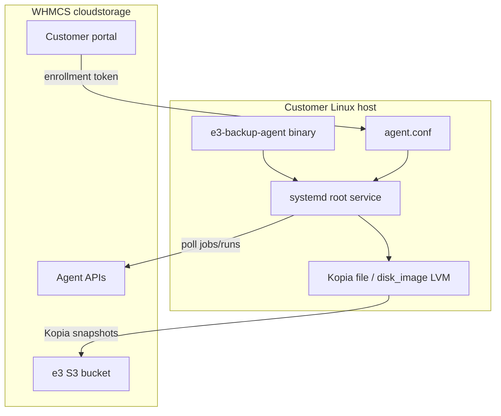

# Linux e3 Local Backup Agent — Production Readiness Review

*Date: 2026-08-06*
*Agent build: commit `07daf134`, Go 1.25.8, linux/amd64*
*Lab host: Ubuntu 22.04.5 LTS (`192.168.92.211`)*

## Verdict

**Ready with caveats** for Ubuntu 22.04+ / Debian-family production use:

| Capability | Status |
|------------|--------|
| File/folder backup (Kopia) | **Production-ready** |
| File/folder full restore | **Production-ready** |
| Disk-image backup (LVM snapshot or live device) | **Production-ready** |
| Disk-image block-level restore | **Lab-validated** (cycle passes); product docs still GA-deferred |
| Selective path restore | **Not ready** |
| Kopia mount restore | **Not ready** (`mount not implemented`) |
| Maintenance during active run | **Not ready** (config path bug) |
| Linux BMR / recovery media | **Not available** |
| Packaged installer (.deb/.rpm) | **Not available** |
| RHEL/Rocky/Alma support | **Unvalidated** |

For the stated production bar (Ubuntu/Debian GA: file + disk-image backup/restore, documented root+systemd install, no `.deb` required), the agent **meets core requirements** after today's lab retest. Ship with clear customer documentation of limitations below.

---

## Capability answers

### 1. File/folder backup

**Yes.** The Kopia engine is fully cross-platform. Linux-specific inventory uses `lsblk` (`volumes_linux.go`, `disks_linux.go`) and folder shortcuts (`/home`, `/var`, `/opt`, `/etc`) in `filesystem.go`. Legacy rclone sync engine also works but Kopia is the primary path.

### 2. Disk-image backup

**Yes.** `disk_image_linux.go` implements:

- LVM snapshot via `lvcreate --snapshot --extents 20%ORIGIN` when source is an LVM device
- Fallback to direct live device read when LVM unavailable
- Streams block device into Kopia (no temp sparse file on primary path)
- Layout metadata via `disk_layout_linux.go` (lsblk, sysfs, ext4 extents)

Requires **root** for device access and LVM operations. No Windows-style CBT/VSS; always full-device read.

### 3. Installer

**No packaged installer.** Customers receive a raw amd64 binary:

```
https://accounts.eazybackup.ca/client_installer/e3-backup-agent-linux
```

Install is manual:

1. Copy binary to `/usr/local/bin/e3-backup-agent`
2. Create `/etc/e3-backup-agent/agent.conf` with `enrollment_token` (or post-enroll credentials)
3. Create systemd unit at `/etc/systemd/system/e3-backup-agent.service`
4. `systemctl enable --now e3-backup-agent`

Windows has Inno Setup (`installer/e3-backup-agent.iss`); Linux has only `make install` (binary copy). The portal download button exists (`e3backup_shell.tpl`) but the install modal and Getting Started copy are Windows-skewed.

### 4. Supported Linux distributions

| Target | Status |
|--------|--------|
| **Ubuntu 22.04 LTS** | Lab-validated (this review) |
| **Debian-family** (systemd + apt) | Expected compatible; not separately tested |
| **RHEL / Rocky / Alma** | Not tested; no yum/dnf docs or packages |
| **Alpine / musl** | Not tested; not in build pipeline |
| **arm64** | Not built or published |

**Runtime assumptions:**

- systemd (service management, self-update restart)
- util-linux: `lsblk`, `blockdev`, `sfdisk`, `partprobe`
- Optional: `lvm2` (disk-image LVM snapshots), `e2fsprogs` (ext4 layout/resize), `grub-install`, `ntfsresize`
- Go binary: `linux/amd64`, `CGO_ENABLED=0` (static-ish, no external kopia CLI)

**Not Debian-only** in code — there are no apt-specific calls in the agent. However, only Ubuntu 22.04 has end-to-end lab coverage today.

---

## Lab test results (2026-08-06)

Build: `./bin/e3-lab build` → commit `07daf134`
Deploy: `./bin/e3-lab deploy --target linux`
Prepare: `./bin/e3-lab prepare --target linux` (recreates `/dev/e3-lab/test-volume`)

### Tier A — core (required)

| Scenario | Result | Artifact |
|----------|--------|----------|
| `linux-file` | **PASS** | `20260806T164511Z-linux-file` |
| `linux-file-cycle` | **PASS** | `20260806T164618Z-linux-file-cycle` |
| `linux-disk-image` | **PASS** | `20260806T164909Z-linux-disk-image` |
| `linux-disk-image-cycle` | **PASS** | `20260806T165032Z-linux-disk-image-cycle` |

`linux-file-cycle` verified oldest + newest restore points with SHA256 fixture match.
`linux-disk-image-cycle` verified block-level restore to loop devices (`/dev/loop10`, `/dev/loop11`) with disk fixture match.

### Tier B — hardening

| Scenario | Result | Notes |
|----------|--------|-------|
| `linux-file-cancel` | **PASS** | Mid-backup cancel works |
| `linux-file-concurrent` | **PASS** | Parallel start-run fan-out |
| `linux-file-concurrent-guard` | **PASS** | ALREADY_RUNNING rejection |
| `linux-maintenance-quick` | **FAIL** | Backup run failed when maintenance queued mid-run |
| `linux-file-retention-prune` | **FAIL** | Lab harness: `maintenance_full` called without active run |
| `linux-file-resilience-outage` | **PASS** | iptables S3 outage mid-backup; recovery after revert |
| `linux-file-selective-restore` | **FAIL** | `selected path not found (data/iteration-1/file-001.bin)` |
| `linux-file-mount-restore` | **FAIL** | `mount not implemented` (expected GA deferral) |

### Failure details

**linux-maintenance-quick**
```
error_summary: open for maintenance: error loading config file:
  open /var/lib/e3-backup-agent/runs//job_019fd80e-....config: no such file or directory
```
Double slash in path suggests a bug when opening job config for in-run maintenance. Maintenance command was queued successfully but the parent backup run failed.

**linux-file-selective-restore**
```
backup engine: selected path not found (data/iteration-1/file-001.bin): entry not found
```
Selective path restore (`--selected-paths-json`) does not resolve paths correctly on Linux.

**linux-file-mount-restore**
```
mount not implemented
```
Kopia FUSE mount restore is not implemented (`kopia.go` returns this error). Matches `BETA_KNOWN_LIMITATIONS.md` GA deferral.

---

## Prioritized gap list

### P0 — blockers for broader production

| # | Gap | Recommendation |
|---|-----|----------------|
| 1 | **No Linux install package or shipped systemd unit** | Ship a `.deb` with binary + unit + `/etc/e3-backup-agent/agent.conf.example`, or at minimum bundle `e3-backup-agent.service` in `client_installer/` with install script |
| 2 | **Onboarding docs reference nonexistent `-enroll` CLI** | Fix `BETA_ONBOARDING.md`: enrollment is via `agent.conf` `enrollment_token`, not `e3-backup-agent -enroll -token` |
| 3 | **Portal install UX is Windows-only** | Add Linux install snippet to token modal (binary download + conf + systemd commands) matching `LOCAL_AGENT_BUILD.md` |

### P1 — functional gaps affecting operations

| # | Gap | Recommendation |
|---|-----|----------------|
| 4 | **Maintenance during active run fails** | Fix double-slash job config path in maintenance code path (`runner.go` / run dir join) |
| 5 | **Selective path restore broken** | Fix path resolution in `kopia.go` restore for `selected_paths` on Linux |
| 6 | **Kopia mount restore not implemented** | Implement FUSE mount on Linux or hide "Mount snapshot" in portal for Linux agents until GA |
| 7 | **Disk-image restore GA status unclear** | Lab cycle passes block-level restore; reconcile `BETA_KNOWN_LIMITATIONS.md` with actual Linux restore capability or restrict portal restore UI until formally GA |

### P2 — distro / packaging expansion

| # | Gap | Recommendation |
|---|-----|----------------|
| 8 | **RHEL/Rocky untested** | Add lab host or CI matrix; document `dnf install lvm2 e2fsprogs` prerequisites |
| 9 | **LVM volume not persistent across reboot** | Lab-only: document `prepare` step; customer docs should explain LVM snapshot prerequisites |
| 10 | **No arm64 build** | Add `GOARCH=arm64` to AgentBuild if ARM servers are in scope |
| 11 | **Run log/event collection empty in lab analyze** | Harness collects 0 events/logs; investigate agent event delivery or lab collector (cosmetic for backups, affects observability testing) |

### P3 — future / out of scope

| # | Gap | Notes |
|---|-----|-------|
| 12 | Linux BMR / recovery ISO | No equivalent to WinPE recovery agent |
| 13 | Hyper-V, Cloud NAS, tray UI | Windows-only by design |
| 14 | CBT / incremental disk-image | Windows-only; Linux always full read |
| 15 | Encryption-key rotation, corrupt-restore admin path | GA-deferred per beta docs |
| 16 | `client_id` 1231 missing from `tblclients` | Lab `doctor` fails; fix lab fixture |

---

## Architecture summary



---

## Recommended production rollout

1. **Ship for Ubuntu 22.04+ / Debian 12+** with manual install docs corrected.
2. **Document prerequisites**: root systemd service, `lvm2` for disk-image on LVM sources, `e2fsprogs` recommended.
3. **Set customer expectations**: full file restore yes; disk-image backup yes; disk-image restore available but document as beta/limited until formally GA; no selective/mount restore; no BMR.
4. **Before RHEL GA**: add Rocky/Alma lab host and run Tier A matrix.
5. **Before self-service at scale**: ship `.deb` + corrected portal install flow.

---

## Test reproduction

```bash
cd /var/www/eazybackup.ca/e3-agent-lab
./bin/e3-lab build
./bin/e3-lab deploy --target linux
./bin/e3-lab prepare --target linux

# Tier A (core)
./bin/e3-lab run --scenario linux-file
./bin/e3-lab run --scenario linux-file-cycle
./bin/e3-lab run --scenario linux-disk-image
./bin/e3-lab run --scenario linux-disk-image-cycle

# Tier B (hardening)
./bin/e3-lab run --scenario linux-file-cancel
./bin/e3-lab run --scenario linux-file-concurrent
./bin/e3-lab run --scenario linux-file-resilience-outage
```

Artifacts: `/var/www/eazybackup.ca/e3-agent-lab/artifacts/20260806T*`

---

## Post-implementation update (2026-08-06)

Shipped Linux installer (`install.sh` + `.deb`), portal enrollment UX, and P1 agent fixes.

| Item | Result |
|------|--------|
| `linux-maintenance-quick` | **PASS** (after Connect-on-missing fix) |
| `linux-file-selective-restore` | Restore **PASS**; lab verify compares full fixture (harness limitation) |
| `linux-file-cycle` | **PASS** (regression) |
| Installer artifacts | `e3-backup-agent-linux-install.sh`, `e3-backup-agent-linux.deb` in `client_installer/` |

Updated verdict: **Ready for Ubuntu/Debian customer self-service** with token-based install commands. Mount restore remains deferred; Linux BMR still N/A.
