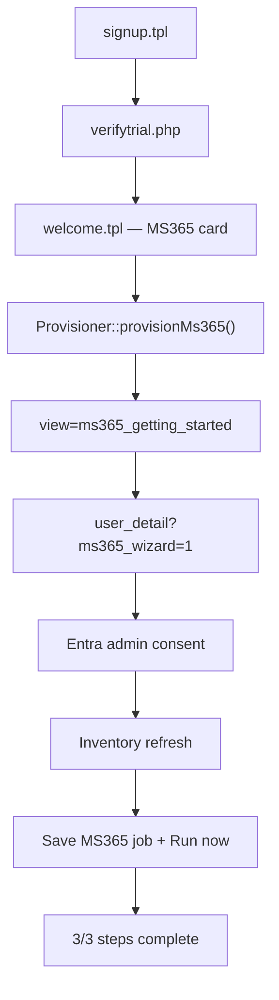

# Microsoft 365 Backup — First-run onboarding

Customer-facing onboarding for **new trial signups** who choose Microsoft 365 Backup on the Welcome page. MSP / existing clients who add MS365 later use the job wizard on User detail directly (no Getting Started redirect).

Companion docs:

- [`CUSTOMER_ONBOARDING.md`](../../ms365backup/Docs/CUSTOMER_ONBOARDING.md) — connect flow and ops checklist
- [`CLOUD_STORAGE_README.md`](CLOUD_STORAGE_README.md) — Welcome provisioning overview

---

## End-to-end journey (welcome signup)

---

## Provisioning (what happens before Getting Started)

`Provisioner::provisionMs365()` in `lib/Provision/Provisioner.php`:

| Step | Action |
|------|--------|
| WHMCS service | `AddOrder` + `AcceptOrder` (`autosetup=false`) for `pid_ms365_backup` |
| Backup user | `s3_backup_users` with `backup_type=cloud_only` |
| Trial | `Ms365BillingTrial::startTrial()` — days from `ms365_trial_days` |
| Storage | `Ms365StorageBootstrapService::ensureForBackupUser()` — platform owner + `e3ms365-*` bucket |
| Redirect | `index.php?m=cloudstorage&page=e3backup&view=ms365_getting_started` |

---

## Three-step model

State from `Ms365Onboarding::computeForBackupUser()` (also exposed via `api/ms365_onboarding_status.php`):

| Step | Key | Complete when |
|------|-----|----------------|
| 1 | `connect` | `ms365_tenant_records.connection_status = connected` |
| 2 | `inventory` | Graph inventory exists for backup user |
| 3 | `first_backup` | At least one successful `ms365_backup_runs` row |

---

## Routes and files

| Item | Path |
|------|------|
| Page handler | `pages/e3backup_ms365_getting_started.php` |
| Template | `templates/e3backup_ms365_getting_started.tpl` |
| URL | `index.php?m=cloudstorage&page=e3backup&view=ms365_getting_started` |
| Wizard CTA | `view=user_detail&user_id={public_id}&ms365_wizard=1#jobs` |
| Access helper | `lib/Client/E3BackupAccess.php` |
| Sidebar | `templates/partials/e3backup_sidebar.tpl` — MS365-only clients see MS365 Getting Started (not agent Getting Started) |

The Getting Started page polls `ms365_onboarding_status.php` every 12 seconds until all steps complete.

---

## MS365-only navigation

Clients with MS365 Backup but **without** e3 Cloud Backup (agent product):

- See **Getting Started** → `ms365_getting_started`
- **Agents** nav disabled; **Download Agent** footer hidden
- **Users** and **user detail** remain the hub for jobs and the MS365 wizard

---

## Testing checklist

- [ ] Welcome → MS365 → username → provision succeeds (no Comet module log entries)
- [ ] `tblhosting` MS365 service active; `nextduedate` = today + `ms365_trial_days`
- [ ] `s3_backup_users.backup_type = cloud_only`
- [ ] `e3ms365-*` bucket under `ms365_platform_owner`
- [ ] Lands on `ms365_getting_started`; CTA opens job wizard
- [ ] Connect + inventory + first backup advance stepper
- [ ] e3 Cloud Backup welcome path still → `view=getting_started` (regression)
