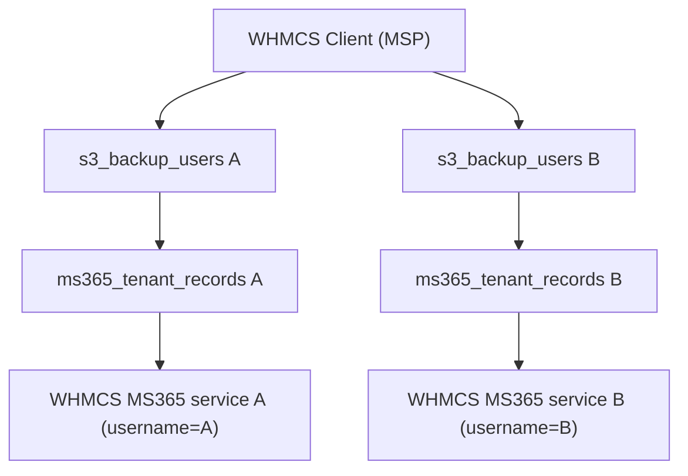
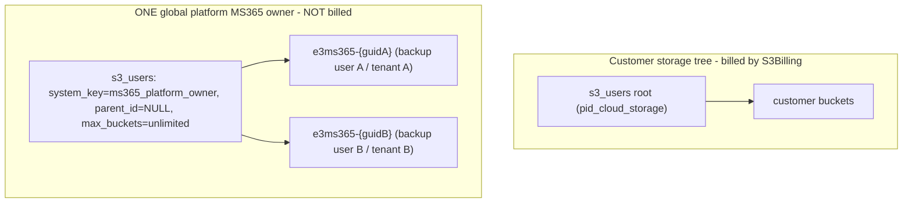

# MS365 Backup — Billing & Storage Design

**Status:** Implemented (v1.20.0)
**Last updated:** 2026-06-17
**Owners:** ms365backup (engines + metering services) + cloudstorage (customer UI, buckets, APIs)

This document specifies how to make the **Microsoft 365 Backup** product billing-ready: a free WHMCS product driven by **config options** for Protected Users and OneDrive overage, **per-backup-user daily metering** sourced from Microsoft Graph, **peak-of-period** billing, admin-configurable pricing, a trial, and **platform-owned, isolated object storage** that never touches the existing object-storage bill.

Read alongside: [PRODUCT_ROADMAP.md](PRODUCT_ROADMAP.md) (product intent/phases), [ARCHITECTURE_BOUNDARIES.md](ARCHITECTURE_BOUNDARIES.md) (module split), and `modules/addons/cloudstorage/docs/E3_CLOUD_BACKUP_BILLING.md` (the metered-billing pattern this design mirrors).

---

## 1. Goals & billing model

- MS365 Backup is sold **per Protected User**, with **unlimited storage** for all workloads **except OneDrive**. Each user includes a configurable amount of OneDrive storage (default **1 TiB**); usage above the included amount is billed **per GiB**.
- The WHMCS product itself is **free, recurring monthly**; all charges come from **config options**. It has a **trial period**.
- Billing adjusts automatically with usage:
  - **Protected Users:** bill the **peak (MAX) count seen during the billing period**. If the count drops mid-period, the reduction does **not** take effect until the next billing period.
  - **OneDrive overage:** bill the **peak total overage GiB** across all users during the period.
- Usage is **tracked daily** and surfaced to the customer with a **per-backup-user, per-user OneDrive breakdown**, so an MSP can see exactly which Microsoft 365 user is over the included limit and by how much (required for re-billing their own end customers).
- **Admin-configurable** from the ms365backup addon settings: OneDrive included GiB, OneDrive overage price per GiB, and per-Protected-User price.

---

## 2. Definitions & tenancy model

### 2.1 Protected User

A **Protected User** is a distinct Microsoft 365 identity (by Azure user id / UPN) that has **at least one personal workload protected**:

- mailbox, OneDrive, calendar, contacts, or tasks.

Rules:

- A user selected via multiple personal workloads is counted **once** (deduplicated by Azure user id).
- **Shared** workloads — SharePoint sites, Teams, M365 Groups, Planner, OneNote — are **included under unlimited storage** and do **not** themselves add billable users.

### 2.2 Tenancy model (how clients, backup users, and WHMCS services relate)

- One **WHMCS client** (often an MSP) → many **backup users** (`s3_backup_users`), each representing one of the MSP's end customers.
- Each **backup user** connects **one** MS365 / Azure tenant via its own `ms365_tenant_records` row (`backup_user_id` → one `azure_tenant_id`).
- **One WHMCS MS365 Backup service per backup user** (product PID from `pid_ms365_backup`, production default **107**). The service **`Username`** field is the backup user's `s3_backup_users.username` so MSPs reconcile invoices by username.
- **Provisioning trigger:** first MS365 job creation (`Ms365CustomerJobService::create` → `Provisioner::ensureMs365ServiceForBackupUser`). Existing clients are **not** put on trial; first invoice is due **registration date + 1 month**.
- Metering and billing are **per backup user / per WHMCS service** (not summed across all backup users on the client).



---

## 3. Current state and why it must change

- **Object-storage billing** in `accounts/crons/s3Billing.php` → `S3Billing::gatherBillingData()` bills `pid_cloud_storage` services at **$9/TiB base + ~$0.0088/GiB overage**, summing the primary `s3_users` account **plus every sub-user** via `S3Billing::handleTenants()` (`accounts/modules/addons/cloudstorage/lib/Admin/S3Billing.php`). There is **no billing-exemption flag** anywhere.
- Today MS365 buckets (`e3ms365-{token}`) are created **one per WHMCS client** by `Ms365StorageBootstrapService` under a system `cloudbackup_owner` sub-user whose `parent_id` is the **customer's e3 storage root** (`CloudBackupBootstrapService::ensureBackupOwnerUser`). Consequently, MS365 bytes are **silently rolled into the customer's object-storage bill** — the central problem to fix.
- There is **no `pid_ms365` setting**. `ms365_tenant_records.whmcs_service_id` exists but is **unused** (`accounts/modules/addons/ms365backup/lib/Ms365Backup/TenantRecordRepository.php`). Legacy MS365 PIDs 52/57 live in the eazybackup addon and are not part of this design.
- **Kopia note (critical for metering):** MS365 data is stored as a **deduplicated Kopia repository** inside the bucket. You **cannot** meter per-user OneDrive bytes by listing S3 prefixes — Kopia stores packed/deduped blobs, not per-source objects. Per-user OneDrive size must come from **Graph-reported drive usage**, which `InventoryService` already records as `meta.size_bytes` + `meta.owner_user_id` per drive in `inventory.json`. This is also the most customer-meaningful figure (the data they are protecting), and it is the confirmed source of truth for OneDrive billing.

---

## 4. Storage architecture (platform-owned, isolated, per backup user)

### 4.1 Target shape

- **One global platform-owned RGW owner**: a single `s3_users` row with `system_key='ms365_platform_owner'`, `is_system_managed=1`, `parent_id=NULL`, under a dedicated platform tenant, with RGW `max_buckets` set to unlimited. **Auto-created on demand** the first time any MS365 bucket is needed (idempotent `ensurePlatformOwner()`).
- **One `e3ms365-{guid}` bucket per backup user** (per MS365 tenant). The GUID is a stable hash of `backup_user_id`, preserving the required `e3ms365-` prefix. Buckets are created under the global platform owner via the existing keyless `createBucketAsAdmin` temp-key flow.
- **The customer never receives keys** to this account (mirrors the keyless owner pattern already used for `cloudbackup_owner`), which prevents accidental object deletion that would corrupt the Kopia repository.



### 4.2 Code changes

- Add `ensurePlatformOwner()` (idempotent) that creates/returns the single `ms365_platform_owner` `s3_users` row and its RGW user (set `max_buckets` unlimited).
- Refactor the MS365 storage path so bootstrap is **keyed by `backup_user_id`** (currently client-only):
  - `Ms365StorageBootstrapService::ensureForBackupUser($clientId, $backupUserId)` resolves the platform owner, derives `e3ms365-{guid(backupUserId)}`, creates the bucket if missing, ensures the Kopia repo, and links `s3_bucket_id` / `s3_bucket_name` / `s3_user_id` onto that backup user's `ms365_tenant_records` row via `TenantRecordRepository::linkCloudStorageBucket`.
  - `TenantRecordRepository::ensureCloudStorageBucketForBackupUser` calls the per-backup-user bootstrap (today it ignores `backupUserId` and bootstraps client-level).
- **Billing safety guard:** in `S3Billing`, skip buckets named `e3ms365-*` and skip the `ms365_platform_owner` account. Because the owner sits outside any customer `parent_id` tree, `handleTenants()` will not traverse it anyway; the guard is defense-in-depth so MS365 storage can never leak into object-storage billing even if linkage changes.

### 4.3 Migration

**None required** — there is no customer data. Existing `e3ms365-*` buckets created under the old per-client owner can be left in place or cleaned up; new connects use the platform owner and per-backup-user buckets.

---

## 5. WHMCS product, settings & config options

### 5.1 Product

- "eazyBackup Microsoft 365 Backup" — **Free** base product, recurring **monthly**; charges from config options. **One service per backup user**, provisioned on first MS365 job (`Provisioner::ensureMs365ServiceForBackupUser`). New-signup onboarding via `provisionMs365()` may still use trials; existing MSP clients provisioning at first job do **not**.

### 5.2 Admin settings (ms365backup addon — `accounts/modules/addons/ms365backup/ms365backup.php`)

| Setting | Purpose | Default |
|---------|---------|---------|
| `pid_ms365_backup` | WHMCS product PID(s) for MS365 Backup (comma-separated supported), read like `pid_cloud_storage` in `s3Billing.php` | — |
| `onedrive_included_gib` | Included OneDrive storage per user, in GiB | `1024` |
| `onedrive_overage_price_per_gib_cad` | Price per GiB above the included amount | — |
| `protected_user_price_cad` | Price per Protected User | — |
| `ms365_trial_days` | Trial length in days | `30` |
| `ms365_config_option_ids` | Auto-stored mapping of metric → WHMCS config option id (mirrors `e3cb_config_option_ids`) | — |

### 5.3 Config options (quantity type)

- `protected_users` — Qty = number of Protected Users (service total).
- `onedrive_overage_gib` — Qty = total overage **GiB** across all users (Qty 1 = 1 GiB).

Prices are taken from the **admin settings** above and applied via the invoice hook (Section 8), so pricing is configurable from module settings rather than baked into WHMCS product pricing.

### 5.4 Service linkage

Populate `ms365_tenant_records.whmcs_service_id` for the **specific backup user** when the WHMCS service is provisioned so metering binds to the correct `tblhosting` row (one service per backup user).

---

## 6. Metering — Protected Users

A new daily cron `accounts/crons/ms365_billing.php` (mirroring `accounts/crons/e3_cloudbackup_billing.php`) drives a `Ms365BillingService` in **ms365backup** (engines/services own metering; cloudstorage surfaces it).

For each active MS365 service (resolved via `pid_ms365_backup`), meter the **single backup user** bound via `ms365_tenant_records.whmcs_service_id` (fallback: match `tblhosting.username` to `s3_backup_users.username`):

1. Load the backup user's `inventory.json` and **selected backup scope**.
2. Compute distinct Azure user ids with ≥1 personal workload protected.
3. Record counts for that backup user only.

**Billing value = MAX(qty) over the current billing window** (anchored to `nextduedate`). Write peak qty to `tblhostingconfigoptions` and update `tblhosting.amount` from rated lines so recurring amount tracks usage during the month.

---

## 7. Metering — OneDrive overage (Graph-sourced, per user)

- Source per-user OneDrive usage from **Graph-reported drive size** in `inventory.json` (`meta.size_bytes`, keyed to `meta.owner_user_id`), refreshed by inventory discovery. (Not from RGW prefixes — see the Kopia note.)
- `included_bytes = onedrive_included_gib` (admin setting). Daily, for each protected user (per backup user) with OneDrive selected:
  - `overage_bytes = max(0, used_bytes - included_bytes)`.
  - Persist a **per-user row** for that day (drives the MSP breakdown + audit).
- **Billing value = MAX(total overage GiB across all the client's users) over the billing window** → `tblhostingconfigoptions.qty` for `onedrive_overage_gib`.

A single overage config option keeps invoicing simple, while the per-user daily table provides full visibility into *which* user is over and by how much.

---

## 8. Pricing, invoice application & trial

- **Quantity automation:** the daily cron writes peak metered quantities to `tblhostingconfigoptions.qty`.
- **Pricing:** an `InvoiceCreationPreEmail` hook (plus a `DailyCronJob` pass) mirroring `accounts/modules/addons/cloudstorage/hooks/e3cb_invoice.php` sets each MS365 config-option line amount from the **admin-setting prices**:
  - `protected_user_price_cad` × Protected Users
  - `onedrive_overage_price_per_gib_cad` × overage GiB
- **Trial:** reuse the e3cb pattern — a `ms365_billing_trial_state` lifecycle (`trialing → converted / suspended_no_payment / cancelled`) with a daily trial-check cron. While `trialing`, line amounts are **zeroed** but qty/unit price are still recorded, so the customer/MSP sees what the trial would cost. Trial length comes from `ms365_trial_days`.

---

## 9. Database — daily tracking tables

| Table | Columns (key) | Purpose |
|-------|---------------|---------|
| `ms365_billing_usage_snapshots` | `service_id`, `client_id`, `backup_user_id`, `metric` ENUM(`protected_users`,`onedrive_overage_gib`), `qty`, `taken_at` | Daily captures; MAX-in-window for rating. Mirrors `s3_cloudbackup_usage_snapshots`. |
| `ms365_onedrive_usage_daily` | `client_id`, `backup_user_id`, `tenant_record_id`, `azure_user_id`, `upn`, `display_name`, `drive_id`, `used_bytes`, `included_bytes`, `overage_bytes`, `collected_date` | Per-user OneDrive breakdown for UI + history. |
| `ms365_billing_trial_state` | service lifecycle fields (e3cb-style) | Trial lifecycle per service. |

---

## 10. UI

### 10.1 Customer (per backup user)

- **Pricing panel** (persistent): `partials/e3backup_pricing_panel.tpl` on the Add User modal and user-detail Billing tab — e3 + MS365 rates (not shown per job).
- **Usage & Billing drawer** on MS365 job cards (`e3backup_user_detail.tpl`) — live usage, peaks, per-user OneDrive table. API: `api/ms365_usage.php`.

### 10.2 Admin (support)

Surface the same Protected Users + storage stats on the **ms365backup admin Jobs page** so support can quickly reference them.

**Trials admin:** `addonmodules.php?module=ms365backup&action=trials` — mirrors `cloudstorage&action=cloudbackup_trials` (filter by status, preview invoice, convert/cancel/re-evaluate, run evaluation for all).

---

## 11. Cron schedule

```
0 6 * * *   php /var/www/eazybackup.ca/accounts/crons/ms365_billing.php                                   # daily meter + rate + applyToWhmcs
30 3 * * *  php /var/www/eazybackup.ca/accounts/modules/addons/ms365backup/crons/ms365_trial_check.php    # daily trial lifecycle
```

---

## 12. Edge cases & decisions

- A user with only a mailbox (no OneDrive selected) is a Protected User but contributes **0** OneDrive overage.
- OneDrive size reflects **live Graph quota usage**, which can change daily; peak-of-period billing smooths this and matches the "no mid-period reduction" rule.
- Disconnected / `action_required` tenants: reuse the last good snapshot and flag staleness in the UI; do not bill from missing inventory.
- A WHMCS client with multiple backup users: **one MS365 WHMCS service per backup user**, each with its own metered config-option quantities (MSP reconciles by service Username).
- One backup user maps to one Azure tenant at a time; metering treats the backup user as the unit.

---

## 13. Phasing

1. **Storage isolation** — global platform owner (auto-created) + per-backup-user `e3ms365-{guid}` bucket + `S3Billing` guard.
2. **Product + settings** — `pid_ms365_backup`, OneDrive/price/trial settings, product + config-option bootstrap, `whmcs_service_id` linkage.
3. **Metering** — tables + `Ms365BillingService` (per backup user, aggregated to service) + daily cron + qty automation.
4. **Pricing + trial** — invoice override hook driven by settings + trial lifecycle cron.
5. **Customer UI** — MS365 job-card button → Usage & Billing panel + `api/ms365_usage.php`.
6. **Admin stats** — Protected Users + storage on the ms365backup admin Jobs page.

---

## 14. Implementation index (paths)

| Area | Path |
|------|------|
| Object-storage billing (to guard) | `accounts/crons/s3Billing.php`, `accounts/modules/addons/cloudstorage/lib/Admin/S3Billing.php` |
| MS365 bucket bootstrap (to make per-backup-user) | `accounts/modules/addons/cloudstorage/lib/Client/Ms365StorageBootstrapService.php`, `CloudBackupBootstrapService.php` |
| Tenant linkage | `accounts/modules/addons/ms365backup/lib/Ms365Backup/TenantRecordRepository.php` |
| OneDrive size source | `accounts/modules/addons/ms365backup/lib/Ms365Backup/InventoryService.php` (`inventory.json` `meta.size_bytes` / `meta.owner_user_id`) |
| Billing pattern to mirror | `accounts/crons/e3_cloudbackup_billing.php`, `accounts/modules/addons/cloudstorage/lib/Admin/E3CloudBackupBilling.php`, `lib/Admin/E3CloudBackupPricing.php`, `lib/Provision/E3CloudBackupProductBootstrap.php`, `hooks/e3cb_invoice.php` |
| Addon settings | `accounts/modules/addons/ms365backup/ms365backup.php` |
| Customer UI | `accounts/modules/addons/cloudstorage/templates/e3backup_user_detail.tpl`, new `api/ms365_usage.php` |
| New cron + tables | `accounts/crons/ms365_billing.php`, `accounts/modules/addons/ms365backup/crons/ms365_trial_check.php`, `ms365_billing_usage_snapshots`, `ms365_onedrive_usage_daily`, `ms365_billing_trial_state` |
