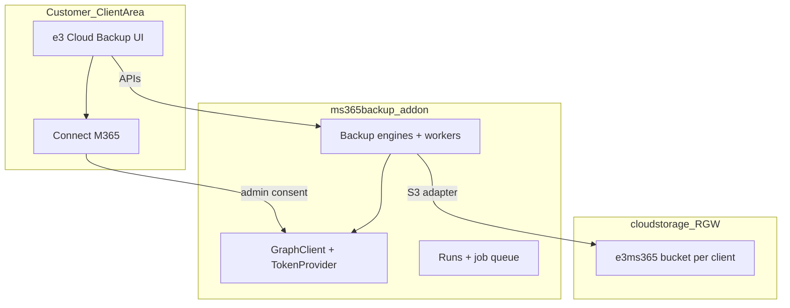

# MS365 Backup — Product roadmap & agent guide

**Purpose:** Describe what we are building, why, and in what order. Agents use this for direction; use [PROGRESS.md](PROGRESS.md) for **current status** and session handoff. Use [ARCHITECTURE_BOUNDARIES.md](ARCHITECTURE_BOUNDARIES.md) for **technical module split** only.

**Last updated:** 2026-06-02

---

## 1. Product vision

**Microsoft 365 Backup** is a WHMCS-integrated SaaS offering: customers connect their Entra tenant, back up M365 data via Microsoft Graph, and store copies in **eazyBackup-owned object storage** (dedicated bucket per customer). They manage everything from **e3 Cloud Backup** in the client area—no Comet panel, no manual Azure secret paste, no per-customer LXD containers.

**Scale target:** Hundreds to thousands of WHMCS clients, each with one or more Entra tenants, queue-backed backup workers, and isolated storage.

**Success looks like:**

- A customer can sign up, connect M365 in a few clicks, run scheduled or on-demand backups, see history and health, and restore mail (then files/calendar) without support intervention.
- Operations can support tenants from the admin engine tool and see queue health, failed jobs, and consent issues.
- Backup data never depends on Comet/eazybackup OBC for MS365.

---

## 2. Product goals (what we must deliver)

| Goal | Description |
|------|-------------|
| **Self-serve connect** | Admin-consent OAuth with a **platform** multi-tenant Entra app; store tenant linkage per WHMCS client. |
| **Complete backup coverage** | Mail, calendar, contacts, tasks, OneDrive, SharePoint, Teams, groups, Planner, OneNote, directory export (engines largely exist in `ms365backup`). |
| **Durable cloud storage** | All production bytes in **e3 RGW** buckets (`e3ms365-{token}`), not ad-hoc S3 config per customer. |
| **e3-native UX** | Connection status, presets, run history, progress, restore wizard—inside `cloudstorage` e3backup, semantic UI theme. |
| **Multi-tenant operations** | Per-client queue limits, run search, retries, access health, support tooling. |
| **Restore SLA** | Supported restore paths (mail first, then files/calendar/Teams) with safe defaults (non-destructive). |
| **Billing-ready** | Linkage to WHMCS service + per-backup-user Graph metering (Protected Users + OneDrive overage) with platform-owned isolated storage. Design: [MS365_BILLING_AND_STORAGE_DESIGN.md](MS365_BILLING_AND_STORAGE_DESIGN.md). |

---

## 3. Users & primary journeys

| Actor | Journey |
|-------|---------|
| **Customer admin** | Purchase MS365 backup → open e3 → Connect Microsoft 365 → refresh inventory → choose preset → run backup → view runs → restore mailbox/files. |
| **eazyBackup support** | Use `ms365backup` admin addon to inspect runs, re-run discovery, debug Graph errors; optionally impersonate client tenant (planned). |
| **Platform ops** | Register Entra app, configure addon secrets, monitor queue workers, RGW capacity, Graph throttling. |

**Customer URL (canonical):**  
`index.php?m=cloudstorage&page=e3backup&view=ms365`

**Not for customers:** `index.php?m=ms365backup` (engine/dev admin only; client area redirects to e3).

---

## 4. Strategic decisions (do not reverse without explicit approval)

| Topic | Decision |
|-------|----------|
| **Comet / LXD MS365** | **Out of scope permanently.** Retire legacy provisioning over time; do not build new features on Comet vaults. |
| **Client UI** | **cloudstorage** e3backup only. **ms365backup** = engines + queue + admin dev tool. |
| **Auth** | Platform Entra app + **admin consent**; client credentials per connected `azure_tenant_id`. No customer secret paste in happy path. |
| **Storage** | **Ms365StorageBootstrapService** + **CloudStorageBackupStorage**; local disk `/var/www/eazybackup/ms365/` for dev only. |
| **Scope selection (v1 customer)** | **Presets** (e.g. User mail+calendar, Collaboration, Full)—not full admin resource picker. |
| **Restore** | Separate **RestoreOrchestrator** and `ms365_restore_runs`; not the same code path as backup engines. |
| **Graph calendar** | No `calendarView` / `calendarView` delta; use established event-list + partition fallback (see [ARCHITECTURE.md](ARCHITECTURE.md)). |

---

## 5. System shape (high level)



**Module reference:** [ARCHITECTURE_BOUNDARIES.md](ARCHITECTURE_BOUNDARIES.md)  
**Engine internals:** [ARCHITECTURE.md](ARCHITECTURE.md)  
**Azure permissions:** [AZURE_SETUP.md](AZURE_SETUP.md)  
**Connect flow (ops):** [CUSTOMER_ONBOARDING.md](CUSTOMER_ONBOARDING.md)

---

## 6. Backup capabilities (engine inventory)

These are implemented in `ms365backup` (phases 2A–2F). Customer UI exposes them gradually via **presets**, not all at once.

| Area | Physical job pattern | Notes |
|------|------------------------|--------|
| User mail / calendar | `user:{id}` | Core MVP preset |
| Contacts / tasks | `user:{id}` | Delta sync |
| OneDrive | `drive:{driveId}` | Binary content to storage |
| SharePoint site | `site:{siteId}` | Libraries + lists |
| Teams | `team:` / `channel:` | Metadata + messages; files via site |
| M365 groups | `group:{groupId}` | Mail/calendar on group |
| Planner | `planner:{planId}` | |
| OneNote | `onenote:{notebookId}` | |
| Directory export | `directory:tenant` | Tenant-wide export |

---

## 7. Development phases

Phases are **sequential on the critical path** for 0 → 1 → 2 → 3; phase 4 can overlap 3; **phase 4b (full e3 UI) before phase 5 restore**; phase 6 is ongoing.

**Live status:** [PROGRESS.md](PROGRESS.md) (updated every agent session).

### Phase 0 — Align boundaries

**Goal:** One architecture story; stop building customer features in the wrong module.

| Deliverable | Module |
|-------------|--------|
| Document ms365backup vs cloudstorage vs Comet | Docs |
| Deprecate standalone `ms365backup` client area | ms365backup |
| WHMCS product linkage (`whmcs_client_id`, optional `service_id`) | WHMCS + DB |
| Register platform Entra app (infra) | Azure / ops |

### Phase 1 — Customer Entra authentication

**Goal:** Connect tenant without secrets or admin dashboard.

| Feature | Notes |
|---------|--------|
| Admin-consent OAuth URL + signed `state` | `EntraConsentService` |
| Callback route in cloudstorage | `view=ms365_connect_callback` |
| `ms365_tenant_records` consent fields | `azure_tenant_id`, `connection_status`, health |
| Graph health probe | Surface “action required” in UI |
| Permission manifest | [AZURE_SETUP.md](AZURE_SETUP.md); re-consent when scopes grow |

**UX:** Not connected | Connected | Action required.

### Phase 2 — e3 object storage

**Goal:** Every connected customer has a dedicated bucket; production backups go there.

| Feature | Notes |
|---------|--------|
| `Ms365StorageBootstrapService` | Bucket name `e3ms365-{token}` |
| Link bucket on tenant record | `s3_bucket_id`, `s3_bucket_name`, `s3_user_id` |
| `CloudStorageBackupStorage` | Keys `{azure_tenant_id}/users/…` |
| Bootstrap after consent | Before first backup |
| Binary streams (OneDrive/SharePoint) | Must use storage adapter in prod |
| Metering / billing hook | See `cloudstorage/docs/E3_CLOUD_BACKUP_BILLING.md` |

### Phase 3 — e3 client area UI

**Goal:** Customers manage M365 backup entirely from e3.

| Feature | Priority |
|---------|----------|
| Sidebar “Microsoft 365” + `view=ms365` | Done (baseline) |
| Connect + connection status | Done (baseline) |
| APIs: status, connect_start, start_backup, runs_list | Done (baseline) |
| **Inventory refresh** API + UI | High — required before reliable presets |
| **Scope presets:** Collaboration, Full | Medium |
| **Run detail** + log tail (like `e3backup_live.tpl`) | Medium |
| **Onboarding steps** (connect → inventory → first run) | Medium |
| Welcome/provision → e3 connect (not Comet panel) | Partial — redirect updated; LXD provision legacy remains |

### Phase 4 — Operational scale

**Goal:** Run reliably at many tenants; support can diagnose quickly.

| Feature | Notes |
|---------|--------|
| Queue: per-client concurrency, stale `running` recovery | Baseline in place |
| Run search/filters in e3 UI | API partial; UI filters TBD |
| Failed-engine retry | `FailedEngineRetryService` |
| Access health dashboard | API + aggregate probes |
| Admin: impersonate / re-inventory | Not started |

### Phase 4b — Unified e3 Microsoft 365 UX (client area)

**Goal:** Replace the minimal `view=ms365` page with a **full e3 Cloud Backup experience** so Microsoft 365 feels like a **backup destination / engine choice** inside e3—not a separate product bolted on the side.

**Position in the plan:** After Phase 3 MVP and Phase 4 ops baseline; **before** Phase 5 restore depth and Phase 6 GA. Restore UI (Phase 5) should build on this shell, not on the current single-page layout.

**Design intent**

| Today (Phase 3 MVP) | Target (Phase 4b) |
|-------------------|-------------------|
| One scrollable page (`e3backup_ms365.tpl`) | Multi-surface flow aligned with e3 Jobs / Live / Users patterns |
| “Microsoft 365” as a sidebar island | M365 as a **workload** under e3: same chrome, navigation, empty states, and action patterns |
| Presets + inline run expand | Resource-aware backup planning, run list/detail comparable to agent backups |
| Minimal restore block | Restore entry points reserved; implementation in Phase 5 |

**Deliverables (to be detailed in [MS365_E3_UI_SPEC.md](MS365_E3_UI_SPEC.md))**

| Area | Direction (draft) |
|------|-------------------|
| **Information architecture** | How M365 fits in e3 sidebar, breadcrumbs, and cross-links (e.g. from Jobs, storage, billing) |
| **Connection & health** | Connection card, consent/re-consent, license/capability banners (e.g. no SPO), storage readiness |
| **Onboarding** | Guided steps (connect → inventory → first backup) matching e3 onboarding patterns |
| **Inventory** | Browse/filter tenant resources; summary counts; refresh status; warnings |
| **Backup** | Preset or policy selector; schedule placeholder; “what will run” preview before start |
| **Runs** | List + filters; detail drawer or live-style panel; logs, progress, retry/cancel |
| **Storage** | Bucket name, usage hint, link to e3 storage browser where appropriate |
| **APIs** | Extend `ms365_*` APIs only as needed; prefer reusing e3 patterns from agent backup |
| **Visual design** | [SEMANTIC-THEME-REFERENCE.md](../../eazybackup/Docs/StyleGuides/SEMANTIC-THEME-REFERENCE.md); parity with `e3backup_jobs.tpl`, `e3backup_live.tpl`, `e3backup_shell.tpl` |

**Module ownership**

| Layer | Module |
|-------|--------|
| Templates, shell, client JS, new `ms365_*` API fields | **cloudstorage** |
| Graph, engines, runs, inventory, restore orchestration | **ms365backup** |

**Spec workflow:** Product owner fills **[MS365_E3_UI_SPEC.md](MS365_E3_UI_SPEC.md)** (wireframes, flows, copy). Agents implement against that spec using **[Prompts/ms365_e3_ui_agent_prompt.md](Prompts/ms365_e3_ui_agent_prompt.md)**.

**Status:** Not started (MVP page remains until 4b ships).

### Phase 5 — Restore platform

**Goal:** Production-grade **Kopia snapshot** restore via Go worker, separate from backup.

| Sub-phase | Feature |
|-----------|---------|
| 5a | **Mail** — granular message restore from Kopia snapshot; skip duplicates (`internetMessageId`) |
| 5b | OneDrive / SharePoint file restore |
| 5c | Calendar restore — no attendee notification emails |
| 5d | Teams / Planner / OneNote / contacts / tasks |
| All | Restore wizard in e3 Restore tab; point-in-time from batch snapshot; live progress |
| All | **Kopia-only** — PHP JSON restore path removed from production |

**Engine:** Go worker `browse` + `restore` against Kopia `manifest_id`; `ms365_restore_runs` + parent `s3_cloudbackup_runs` (`run_type=restore`).

### Phase 6 — Hardening & GA

| Area | Work |
|------|------|
| Security | OAuth state, token storage, bucket isolation, path traversal |
| Scale | Load test queue + Graph throttling (500–1000 tenants) |
| Quality | 2F engine verification in staging tenants |
| Docs | Customer docs + support runbooks (no Comet) |

---

## 8. Customer-facing feature checklist (target product)

Use this as the **north star**; not all items are shipped yet.

- [ ] Purchase / provision MS365 backup SKU in WHMCS
- [x] Connect Microsoft 365 (admin consent)
- [ ] Connection health and re-consent when permissions change
- [ ] Refresh tenant inventory from UI
- [x] Run backup with at least one preset (mail + calendar)
- [ ] Additional presets (collaboration, full tenant)
- [ ] Scheduled / recurring backups (policy TBD)
- [x] View backup run history
- [ ] Run detail with live log / progress
- [ ] Storage usage / metering in UI
- [x] Retry failed run (baseline)
- [ ] Restore mail with point-in-time and safety prompts
- [ ] Restore OneDrive / SharePoint files
- [ ] Restore calendar
- [ ] Email notifications on failure (TBD)

---

## 9. Explicitly out of scope

- Comet / eazybackup OBC LXD MS365 containers (`EazybackupObcMs365`)
- `panel.eazybackup.ca` Comet-style MS365 auth for new customers
- Calendar Graph `calendarView` delta API
- Full resource picker in client area (admin addon keeps full picker for eng/support)
- Cross-product restore from Comet vaults
- Local e3 backup agent handling M365 Graph backup (M365 is cloud Graph only)

---

## 10. How agents should use this document

1. **Start here** for product intent and phase ordering.
2. Read **[PROGRESS.md](PROGRESS.md)** for what is done, gaps, and last session notes.
3. Read **[ARCHITECTURE_BOUNDARIES.md](ARCHITECTURE_BOUNDARIES.md)** before choosing which module to edit.
4. Plan your own implementation steps for the assigned task; you do not need a step-by-step spec in this file.
5. **Before ending a session:** update PROGRESS.md; update this file or linked docs only if goals, phases, or decisions changed.

**Related prompts:** [Prompts/ms365_product_agent_prompt.md](Prompts/ms365_product_agent_prompt.md) (product work), [Prompts/ms365backup_agent_prompt.md](Prompts/ms365backup_agent_prompt.md) (engine/admin deep dives).

**e3 / cloudstorage context:** `modules/addons/cloudstorage/docs/`  
**Client UI styling:** `modules/addons/eazybackup/Docs/StyleGuides/SEMANTIC-THEME-REFERENCE.md`

---

## 11. Recommended execution order

```text
Phase 0 → Phase 1 (auth) → Phase 2 (storage) → Phase 3 (UI MVP)
                              ↘ Phase 4 (ops) can overlap Phase 3
Phase 4b (unified e3 M365 UX) — before Phase 5 restore UI/engine depth
Phase 5 (restore) after 4b shell + backup stable in staging
Phase 6 ongoing
```

**Near-term priorities** (see PROGRESS.md): **define Phase 4b UI spec**, staging E2E backup, then implement 4b; restore (Phase 5) and GA (Phase 6) follow.
