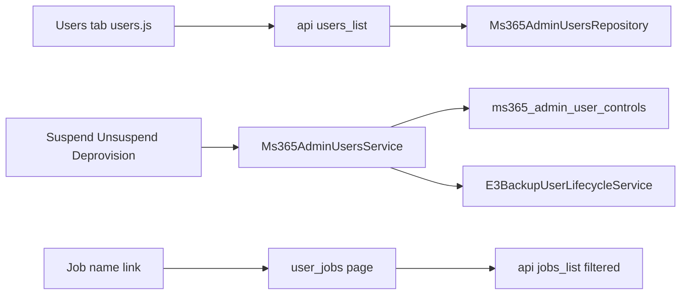

# MS365 Admin Users Tab — Design

**Status:** Approved for implementation  
**Date:** 2026-07-27  
**Module:** `ms365backup` (admin addon)

---

## 1. Goal

Add an admin **Users** tab listing Microsoft 365 backup users with operational columns (client, username, status, billing metrics, vaults, jobs) and lifecycle actions (Suspend, Unsuspend, Deprovision). Job names link to per-user, per-job batch history. Admin suspend uses a durable lock so customers cannot override via run-now or unpause.

## 2. Architecture

Mirror the existing **Jobs** tab: PHP page shell + `assets/js/*.js` + `addonmodules.php?module=ms365backup&action=api` operations.

| Layer | Responsibility |
|-------|----------------|
| `Ms365AdminUsersRepository` | Paginated user list with billing/vault/job enrichment |
| `Ms365AdminUserControlsRepository` | `ms365_admin_user_controls` lock row + `isAdminSuspended()` |
| `Ms365AdminUsersService` | Suspend, unsuspend, deprovision orchestration |
| `user_jobs.php` + `jobs.js` | Reuse Jobs table filtered by `backup_user_id` + `job_id` |
| Customer gates | `Ms365CustomerJobService::runNow`, `cloudbackup_update_job.php` (unpause), `ms365_job_save.php` (create) |

## 3. Locked decisions

| Topic | Decision |
|-------|----------|
| List scope | Non-deleted backup users with MS365 tenant record **and/or** MS365 jobs |
| Status badges | **Active**, **Suspended** (admin lock or WHMCS Suspended), **Disabled** (`s3_backup_users.status`) |
| Suspend | Admin lock + pause MS365 jobs + WHMCS `Suspended` + suspension email (best-effort) |
| Unsuspend | Clear lock + restore job statuses from JSON + WHMCS `Active` + unsuspension email |
| Deprovision | `E3BackupUserLifecycleService::deleteUser(..., skipConfirm: true)` after `DELETE {username}` confirm |
| Job links | New tab → `action=user_jobs&backup_user_id=&job_id=` |
| Customer override | Blocked while admin-suspended (run now, unpause, new job create) |

## 4. Schema — `ms365_admin_user_controls`

| Column | Type | Notes |
|--------|------|-------|
| `backup_user_id` | INT UNSIGNED PK | `s3_backup_users.id` |
| `client_id` | INT UNSIGNED | WHMCS client |
| `admin_suspended_at` | DATETIME NULL | Set on suspend |
| `admin_suspended_by` | INT UNSIGNED NULL | Admin id |
| `prior_job_statuses_json` | TEXT NULL | `{job_id: status}` before pause |
| `notes` | TEXT NULL | Optional admin note |
| `created_at` | TIMESTAMP | |
| `updated_at` | TIMESTAMP | |

## 5. API operations

| Op | Method | Params |
|----|--------|--------|
| `users_list` | GET | `search`, `status`, `page`, `per_page` |
| `users_suspend` | POST | `backup_user_id`, optional `notes` |
| `users_unsuspend` | POST | `backup_user_id` |
| `users_deprovision` | POST | `backup_user_id`, `confirm_phrase` |

Extend `jobs_list` with `backup_user_id`, `job_id`.

## 6. UI

- Nav tab **Users** beside Jobs (sidebar + top nav + routing).
- `users.php`: filters (search, status), table, CSRF/API constants.
- `users.js`: render columns; Actions dropdown (Suspend / Unsuspend / Deprovision context-sensitive).
- `user_jobs.php`: header (client, username, job name); embed Jobs chrome with forced filters.

## 7. Out of scope

Bulk actions, impersonation, customer Users UI redesign, Comet paths.
