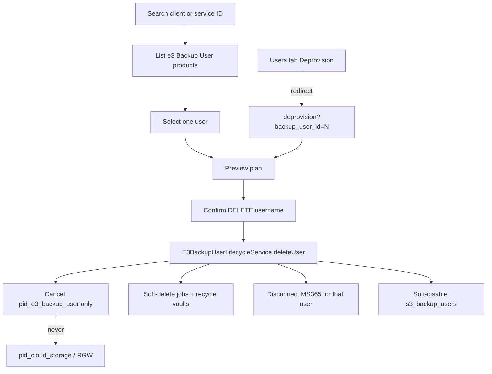

# MS365 Admin e3 Backup User Deprovision — Design

**Status:** Approved for implementation  
**Date:** 2026-08-02  
**Module:** `ms365backup` (admin addon)

---

## 1. Goal

Give WHMCS admins a CloudStorage-style deprovision workflow for a **single e3 Backup User** product inside the MS365 addon, with explicit preview of users/vaults and a hard guarantee that **e3 Object Storage is never cancelled**.

## 2. Architecture

New `action=deprovision` admin page + `Ms365AdminDeprovisionService` for search/list/enriched preview. Execute via existing `E3BackupUserLifecycleService::deleteUser` / `Ms365AdminUsersService::deprovision`. Users-tab Deprovision becomes a deep-link to the new page.

| Layer | Responsibility |
|-------|----------------|
| `Ms365AdminDeprovisionService` | Client/service search, product listing, enriched preview |
| `E3BackupUserLifecycleService` | Actual teardown (unchanged cascade) |
| `Ms365AdminUsersService::deprovision` | Confirm phrase + admin audit |
| `pages/admin/deprovision.php` + `assets/js/deprovision.js` | Admin UI |

## 3. Locked decisions

| Topic | Decision |
|-------|----------|
| Page location | Dedicated `action=deprovision` in ms365backup (not CloudStorage) |
| List scope | All active e3 Backup User products for a client (not MS365-only) |
| Deprovision mode | One user at a time |
| Cascade | Full `E3BackupUserLifecycleService` (jobs, MS365 vault recycle, agents, cancel `pid_e3_backup_user`) |
| Object storage | Never cancel `pid_cloud_storage` / never call `DeprovisionHelper::queueDeprovision` |
| Users tab | Deprovision menu item → navigate to `action=deprovision&backup_user_id=N` |
| Confirm phrase | `DELETE {username}` |

## 4. UI

1. Intro banner: cancels e3 Backup User only; object storage offboarding stays on CloudStorage Deprovision.
2. Customer typeahead (name, company, email, client ID) → product table.
3. Or Service ID lookup → same table.
4. Product table: Service ID, Username, Status, Backup type, MS365 connected?, Job count, Vault count, Select.
5. Preview panel with Will / Will NOT sections.
6. Confirm input `DELETE {username}` enables Deprovision button.
7. Deep-link `?action=deprovision&backup_user_id=N` skips search and opens preview.

## 5. API operations

| Op | Method | Params |
|----|--------|--------|
| `deprovision_client_search` | GET | `q` |
| `deprovision_list_users` | GET | `client_id` |
| `deprovision_lookup_service` | GET | `service_id` |
| `deprovision_preview` | GET | `backup_user_id` |
| `deprovision_execute` | POST | `backup_user_id`, `confirm_phrase` |

Keep `users_deprovision` for API compatibility.

## 6. Out of scope

Bulk multi-user deprovision, immediate hard bucket wipe, Reset Onboarding PID fix, CloudStorage deprovision changes.
