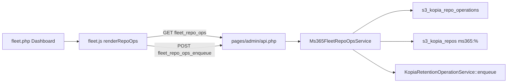

# Fleet Dashboard — Compaction / Repo Ops Visibility — Design

**Status:** Approved for implementation  
**Date:** 2026-08-03  
**Module:** `ms365backup` (Worker Fleet admin UI)

---

## 1. Goal

Let WHMCS admins see MS365 Kopia repo operation / compaction status (and enqueue maintenance) from the Worker Fleet Dashboard, without using `ms365_repo_ops_diag.php` on the server.

## 2. Locked decisions

| Topic | Decision |
|-------|----------|
| Placement | Dashboard tab only (panel after summary wells, before Recent audit) |
| Content | **Both** active strip (queued/running) + recent history table |
| Enqueue | Yes — repo dropdown + `maintenance_quick` / `maintenance_full` / `retention_apply` |
| Environment | **Local DB only** — panel always reflects the current WHMCS environment; no `fleet_remote` |
| Filters | None in v1 |
| Cancel / reap UI | Out of scope |
| Cloudstorage Retention tab | Unchanged |

## 3. Architecture



| Layer | Responsibility |
|-------|----------------|
| `pages/admin/fleet.php` | Static panel shell `#fleet-repo-ops` (and enqueue form containers) |
| `assets/js/fleet.js` | `renderRepoOps()`; poll with dashboard 15s interval; enqueue POST |
| `pages/admin/api.php` | `case 'fleet_repo_ops'`, `case 'fleet_repo_ops_enqueue'` |
| `Ms365FleetRepoOpsService` | List active/recent/repos; summarize `result_json`; enqueue with token |

No changes to `fleet_remote.php` or `FleetFacade` for this feature.

## 4. API

### `GET` `op=fleet_repo_ops`

Auth: admin session (same as `fleet_summary`).

Response:

```json
{
  "ok": true,
  "active": [ /* OpRow */ ],
  "recent": [ /* OpRow */ ],
  "repos": [ { "id": 20, "repository_id": "ms365:…", "client_id": 1 } ]
}
```

**OpRow fields:** `id`, `repo_id`, `repository_id`, `op_type`, `status`, `attempt_count`, `claimed_by_node_id`, `phase`, `effective_mode`, `index_blobs_before`, `index_blobs_after`, `escalated`, `skipped`, `duration_seconds`, `created_at`, `updated_at`, `error` (from `result_json.error` when present).

**Active:** `status IN ('queued','running')`, MS365 repos only, order running first then queued by `created_at`, limit 25.

**Recent:** last 50 MS365 repo ops any status, `ORDER BY id DESC`.

**Repos:** active `s3_kopia_repos` with `repository_id LIKE 'ms365:%'`, limit ~100, for enqueue dropdown.

Missing tables → `{ ok: true, active: [], recent: [], repos: [] }`.

### `POST` `op=fleet_repo_ops_enqueue`

Auth: admin session + CSRF (`token`).

Body: `repo_id` (int), `op_type` (`maintenance_quick` | `maintenance_full` | `retention_apply`).

Behavior:

1. Validate repo exists and `repository_id` starts with `ms365:`.
2. Build payload `{ repo_id, engine: 'ms365' }`. Prefer attaching `e3_job_id` from the most recent op payload for that repo that has one; if none, enqueue without it (UI already documents password risk for maintenance without job id).
3. Token: `ms365-fleet-{op_type}-{repo_id}-{YmdHis}-{random4}` (unique; avoid weekly token collisions that block intentional re-enqueue).
4. Call `KopiaRetentionOperationService::enqueue(...)`.
5. Return `{ ok: true, status, operation_id?, message }` or `{ ok: false, error }`.

## 5. UI

Panel title: **Repo operations / compaction**.

Muted note: “Shows operations for this WHMCS environment only.”

1. **Active strip** — table for `active[]`. Columns: ID, Repo, Type, Status, Claimed node, Phase, Index blobs, Updated. Empty: “No active MS365 repo operations.”
2. **Enqueue form** — Repo select (from `repos`), Type select (default `maintenance_full`), Enqueue button. Helper text: attaches `e3_job_id` from the latest op for that repo when available (required for correct repo password). Disable while in flight; on success show `operation_id` and re-render.
3. **Recent table** — `recent[]`. Columns: ID, Repo, Type, Status, Claimed node, Phase / Outcome, Index blobs, Attempts, Duration, Created, Updated. Status labels: success / error / running / queued.

Polling: call `renderRepoOps()` from the existing dashboard 15s interval and whenever the dashboard refreshes. Do not add a separate timer.

## 6. Error handling

| Case | Behavior |
|------|----------|
| Schema missing | Empty lists, `ok: true` |
| Invalid enqueue input | `ok: false`, message; keep tables |
| Duplicate / enqueue service error | Surface message from enqueue result |
| List fetch failure | Panel alert; do not wipe enqueue form options if already loaded |

## 7. Testing

- PHP unit/integration: active vs recent split; MS365 filter; summary fields; enqueue rejects non-MS365 repo; enqueue accepts valid types.
- Manual: open Fleet Dashboard on env with ops; confirm poll updates phase; enqueue `maintenance_full` for a known repo when safe.

## 8. Out of scope

- Dual-fleet / `fleet_remote` repo-ops proxy
- Filters, pagination beyond fixed limits
- Cancel / force-reap buttons
- Changes to cloudstorage Retention admin page
- Browse cold/warm latency metrics

## 9. Success criteria

- Admin can see claimed node + live phase for a running compaction without SSH.
- Admin can enqueue `maintenance_full` for an MS365 repo from the Fleet Dashboard.
- Panel works on both Development and Production WHMCS independently (local DB each).
